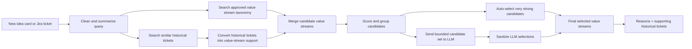
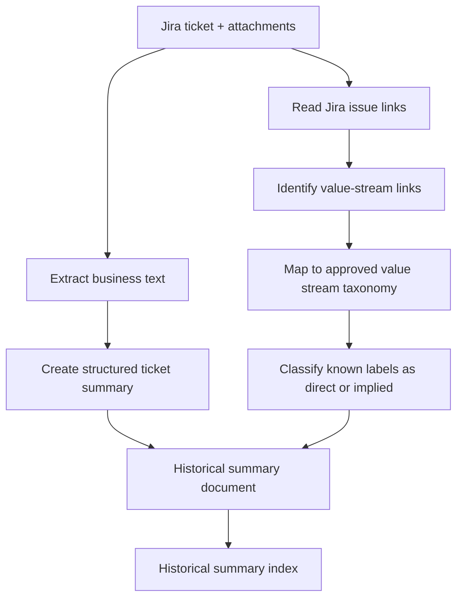
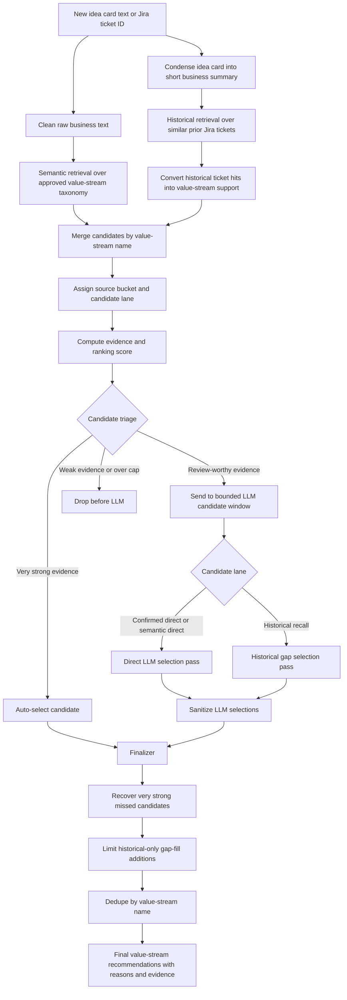
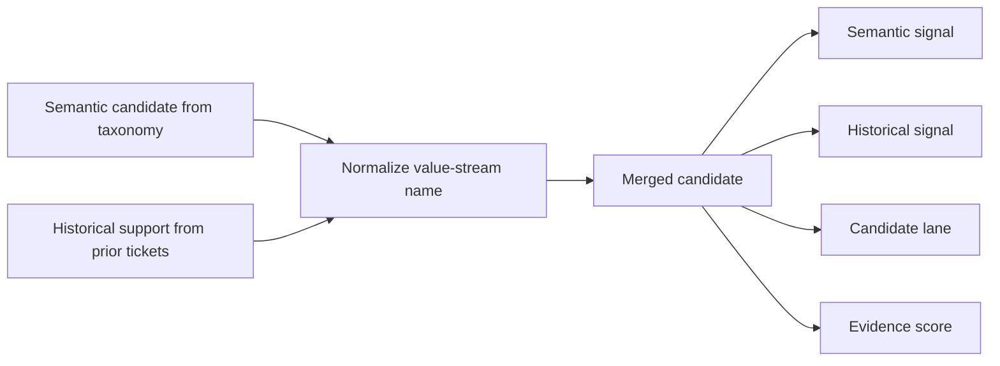
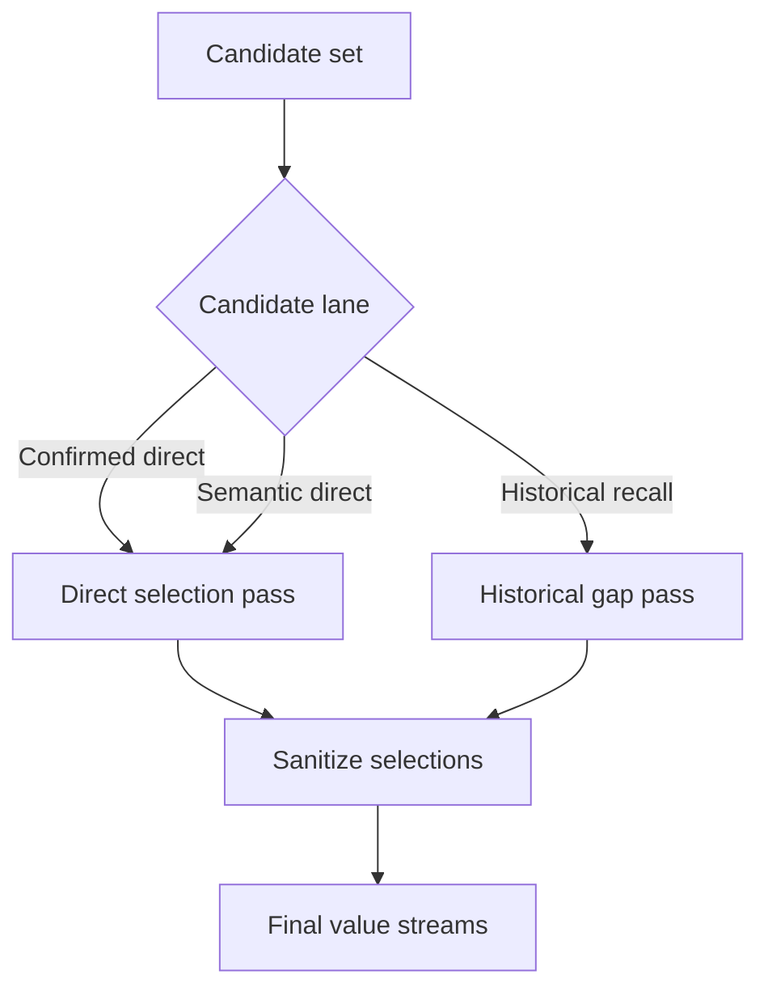
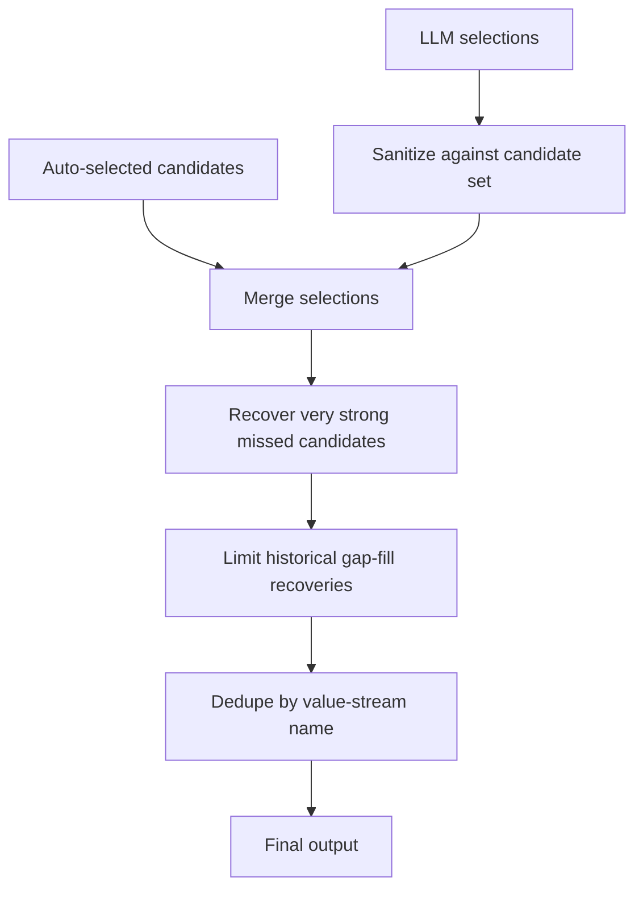
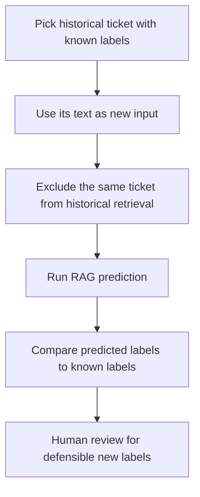

# Client-Ready Value Stream Ingestion + RAG Architecture

## 1. Executive Summary

This architecture predicts **business value streams** for Jira idea cards or initiative documents using a controlled Retrieval-Augmented Generation, or RAG, workflow.

The system is designed for a practical business problem: idea cards often describe work in inconsistent language, while the value stream taxonomy is fixed and structured. A simple keyword search misses implied business impact, while a pure LLM classifier can over-select or invent labels.

The proposed solution combines three signals:

1. **Approved value stream taxonomy** — the official list of value streams the system is allowed to select.
2. **Historical Jira evidence** — previous tickets and their known value-stream relationships.
3. **LLM adjudication** — a bounded decision step where the LLM selects only from retrieved candidates.

The important design principle is:

```text
The LLM does not create value streams.
The LLM only chooses from value streams already retrieved from approved taxonomy and historical evidence.
```

This gives the client an explainable, auditable, and tunable system instead of a black-box classification model.

---

## 2. Business Goal

The goal is to help business and technology teams quickly identify which value streams are impacted by a new idea card, initiative, or Jira ticket.

The system should support:

- faster triage of incoming ideas,
- better consistency in value-stream tagging,
- reuse of historical Jira knowledge,
- explainable recommendations with supporting evidence,
- safer automation without relying on free-form LLM guesses.

---

## 3. Why This Is Needed

Value-stream prediction is difficult because idea cards may not directly mention every impacted stream.

Example:

```text
An idea card discusses member billing communication and inquiry resolution.
```

A pure semantic search may find:

```text
Resolve Request-Inquiry
Manage Member Care
```

But similar historical tickets may show that this type of work also often impacts:

```text
Manage Invoice and Payment Receipt
```

That downstream value stream may not appear directly in the new idea card text, but historical patterns can make it defensible.

This architecture is built to capture both:

```text
Direct match from current idea card
+ implied match from similar historical work
```

---

## 4. Architecture At A Glance



### One-line explanation

```text
The system first finds possible value streams, then uses historical evidence and an LLM to choose the most defensible ones.
```

---

## 5. System Components

| Component | Purpose | Output |
|---|---|---|
| Idea card ingestion | Reads Jira ticket text and supporting documents | Clean consolidated text |
| Value stream label resolution | Maps Jira-linked value stream names to the approved taxonomy | Canonical value-stream names |
| Direct / implied classifier | Marks known historical labels as direct or implied | `direct_vs_names`, `implied_vs_names` |
| Historical summary index | Stores historical ticket summaries and value-stream metadata | Searchable historical precedent |
| Value stream taxonomy index | Stores approved value stream names and descriptions | Searchable official taxonomy |
| Candidate merger | Combines semantic and historical signals | Ranked candidate set |
| LLM selector | Reviews only retrieved candidates | Selected value streams with reasons |
| Finalizer | Sanitizes, dedupes, and applies evidence safeguards | Final output |

---

## 6. Data Architecture

The solution uses two separate indexes.

### 6.1 Value Stream Taxonomy Index

This index contains the approved list of value streams.

It answers:

```text
Which official value streams does the current idea card directly resemble?
```

Example record:

```json
{
  "entity_id": "VS-123",
  "entity_name": "Manage Invoice and Payment Receipt",
  "description": "Business activities related to billing, invoice handling, payment receipt, reconciliation, and related stakeholder workflows.",
  "node_type": "ValueStream"
}
```

### 6.2 Historical Ticket Summary Index

This index contains historical Jira tickets, summarized and enriched with known value-stream metadata.

It answers:

```text
When previous tickets looked similar to this one, which value streams were attached?
```

Example record:

```json
{
  "ticket_id": "IDMT-8199",
  "summary_text": "Improves member and provider inquiry handling across billing and care workflows.",
  "business_problem": "Manual resolution of billing-related inquiries causes delays.",
  "systems_and_products": ["Billing", "Member Care"],
  "direct_vs_names": ["Resolve Request-Inquiry"],
  "implied_vs_names": ["Manage Invoice and Payment Receipt"],
  "label_source": "jira_issuelinks"
}
```

### Why two indexes?

| Index | Why separate? |
|---|---|
| Value stream taxonomy | Keeps predictions restricted to approved labels. |
| Historical tickets | Captures precedent and implied downstream business impact. |

Keeping them separate makes the system easier to debug and explain.

---

## 7. Ingestion Flow

Ingestion prepares historical data so RAG can use it later.

This document intentionally avoids low-level ingestion internals. The main client-facing idea is that ingestion creates trusted historical evidence.



### Ingestion rules

| Rule | Reason |
|---|---|
| Use Jira value-stream links as the historical label source. | Keeps evidence grounded in client data. |
| Map labels to the approved taxonomy. | Prevents duplicate or misspelled labels. |
| Do not invent historical labels when no value-stream link exists. | Avoids fake ground truth. |
| Classify only known labels as direct or implied. | Keeps ingestion controlled and auditable. |
| Store direct/implied labels in the historical index. | RAG can aggregate evidence without reclassifying old tickets. |

---

## 8. RAG Prediction Flow

At prediction time, the system takes a new idea card and turns it into a controlled set of value-stream recommendations.

The flow below is intentionally shown as a **flowchart** instead of a sequence diagram, because this is easier for a client audience to follow. It shows the decision path from raw input to final selected value streams.



### How to read this flow

| Stage | What happens | Why it matters |
|---|---|---|
| Query preparation | The input is cleaned for search and condensed for prompts. | Keeps retrieval focused and reduces prompt noise. |
| Semantic retrieval | The idea card is matched against approved value-stream names and descriptions. | Finds direct business alignment from the current idea card. |
| Historical retrieval | The same idea card is matched against historical Jira ticket summaries. | Finds precedent and downstream patterns that may not be directly stated. |
| Candidate merge | Semantic and historical evidence are combined by value-stream name. | Prevents duplicate candidates and shows whether evidence agrees. |
| Candidate triage | Strong candidates can be auto-selected; plausible candidates go to the LLM; weak candidates are dropped. | Controls cost, noise, and over-selection. |
| LLM selection | The LLM selects only from the bounded candidate list. | Gives reasoning without allowing free-form label creation. |
| Finalizer | The output is sanitized, deduped, and checked for evidence quality. | Produces a governed recommendation list. |

### The two retrieval paths

| Path | What it finds | Example |
|---|---|---|
| Semantic taxonomy retrieval | Approved value streams that directly match the current idea card | “Resolve Request-Inquiry” from inquiry-related wording |
| Historical ticket retrieval | Prior tickets with similar business patterns | Past billing/inquiry tickets that also touched payment receipt |

### Why both paths are needed

```text
Semantic retrieval answers: What does this idea card directly look like?
Historical retrieval answers: What did similar work impact in the past?
Merged RAG answers: Which approved value streams are defensible using both current text and historical precedent?
```

## 9. Candidate Merge Model

After retrieval, the system merges candidates by value-stream name.



### Candidate lanes

| Lane | Source pattern | Interpretation |
|---|---|---|
| Confirmed direct | Found by both taxonomy search and historical evidence | Highest confidence lane |
| Semantic direct | Found only from current idea-card text | Direct but not historically confirmed |
| Historical recall | Found only from similar past tickets | Useful for implied or downstream impact |

This lane model is important because not all candidates should be treated equally.

---

## 10. Thresholds And Defaults

The system uses practical thresholds to control recall, precision, and cost.

These are not meant to be “perfect math.” They are explainable defaults that can be tuned based on evaluation.

### 10.1 Retrieval defaults

| Setting | Recommended MVP default | Reason |
|---|---:|---|
| Candidate request size | `30` | Balanced recall and cost |
| Minimum semantic candidates | `12` | Avoids starving broad tickets |
| Maximum semantic candidates | `50` | Roughly matches the taxonomy size |
| Maximum historical ticket hits | `40` | Prevents too much historical noise |
| LLM candidate window | `40–50` | Gives the LLM enough choices without flooding it |

With a request size of `30`, the system uses approximately:

```text
30 semantic value-stream candidates
30 historical ticket hits
45 merged candidates allowed into LLM review
```

### 10.2 Auto-selection defaults

Auto-selection should happen only when evidence is very strong.

| Auto-select scenario | Simplified default | Why |
|---|---|---|
| Semantic + historical agreement | High semantic score, strong historical similarity, at least 4 supporting observations | Safest case because two independent signals agree |
| Historical direct consensus | Multiple direct historical labels, strong best score, strong average score | Used when history is very consistent |
| Historical implied consensus | Many repeated implied supports, strong average evidence | Used carefully for downstream impact |

### 10.3 LLM admission defaults

Candidates that are not auto-selected may still go to the LLM.

| Lane | Admission approach |
|---|---|
| Confirmed direct | Protect and send to LLM if not auto-selected |
| Semantic direct | Send if semantic score is reasonably strong |
| Historical recall | Send only if repeated or high-quality historical evidence exists |

### 10.4 LLM candidate lane quotas

The LLM window is divided to protect the most useful lanes.

| Lane | Default share | Max candidates |
|---|---:|---:|
| Confirmed direct | 55% | 32 |
| Historical recall | 30% | 18 |
| Semantic direct | Remaining | Remaining |

For a 50-candidate LLM window:

| Lane | Approximate candidates |
|---|---:|
| Confirmed direct | 28 |
| Historical recall | 15 |
| Semantic direct | 7 |

Why this works:

- confirmed candidates are safest,
- historical candidates improve recall,
- semantic-only candidates remain available but do not crowd out stronger evidence.

---

## 11. LLM Selection Strategy

The LLM runs in a bounded mode.

It receives:

```text
idea-card summary
+ retrieved candidate value streams
+ short evidence snippets
```

It does not receive permission to create new value streams.



### Direct selection pass

Used for candidates that have direct evidence from the current idea card.

Default selection limits:

```text
Minimum: 4 when enough plausible candidates exist
Maximum: 22
```

### Historical gap pass

Used for candidates supported only by historical precedent.

Default selection limits:

```text
Minimum: 0
Maximum: 12
```

This allows the model to reject all historical-only candidates if the analog evidence is weak.

---

## 12. Output Safeguards

The finalizer applies guardrails before returning the recommendation.



### Key safeguards

| Safeguard | Purpose |
|---|---|
| Candidate-set sanitization | Removes hallucinated or renamed labels |
| Dedupe by value-stream name | Prevents duplicates from semantic and historical paths |
| Historical gap cap | Prevents historical-only candidates from over-expanding output |
| Evidence-based rescue | Recovers very strong candidates the LLM may miss |
| Supporting ticket IDs | Makes recommendations traceable |

---

## 13. Example Walkthrough

### Input

```text
Idea card:
Improve provider and member billing communication, payment receipt visibility,
and inquiry resolution across member care workflows.

Recommended configuration:
fetch_count = 30
source-ticket exclusion = enabled for evaluation
LLM finalizer = enabled
```

### Step 1: Semantic taxonomy retrieval

The value stream taxonomy search may return:

| Candidate | Signal |
|---|---|
| Resolve Request-Inquiry | Direct inquiry language |
| Manage Member Care | Member care workflow language |
| Manage Invoice and Payment Receipt | Billing and payment receipt language |

### Step 2: Historical retrieval

Similar historical tickets may show repeated support:

| Historical pattern | Supported value stream |
|---|---|
| Prior billing inquiry tickets | Resolve Request-Inquiry |
| Prior member operations tickets | Manage Member Care |
| Prior billing/payment receipt tickets | Manage Invoice and Payment Receipt |

### Step 3: Candidate merge

| Value stream | Semantic signal | Historical signal | Lane |
|---|---|---|---|
| Resolve Request-Inquiry | Yes | Yes | Confirmed direct |
| Manage Member Care | Yes | Yes | Confirmed direct |
| Manage Invoice and Payment Receipt | Yes | Yes | Confirmed direct |
| Downstream payment operations stream | No | Yes | Historical recall |

### Step 4: Final recommendation

Example output:

```json
{
  "selected_value_streams": [
    {
      "entity_name": "Resolve Request-Inquiry",
      "confidence": 0.86,
      "reason": "The idea card impacts inquiry handling and resolution workflows for member and provider support.",
      "supporting_ticket_ids": ["IDMT-8199", "IDMT-12001"]
    },
    {
      "entity_name": "Manage Invoice and Payment Receipt",
      "confidence": 0.78,
      "reason": "The idea card references billing communication and payment receipt visibility, and similar historical tickets show recurring invoice/payment workflow impact.",
      "supporting_ticket_ids": ["IDMT-8204", "IDMT-13118"]
    }
  ]
}
```

---

## 14. Explainability Model

Each selected value stream should be explainable using three questions.

| Question | Example answer |
|---|---|
| Why was this value stream considered? | It was retrieved from the approved taxonomy or historical index. |
| Why was it selected? | The idea card and/or similar historical tickets show a defensible business connection. |
| What evidence supports it? | Semantic match, historical support count, and supporting ticket IDs. |

The client should be able to audit recommendations by tracing:

```text
Final selected value stream
-> candidate lane
-> semantic or historical source
-> supporting ticket IDs
-> business reason
```

---

## 15. Evaluation Approach

The recommended evaluation approach is leave-one-out testing.



### Recommended metrics

| Metric | Meaning |
|---|---|
| Candidate recall before LLM | Did retrieval find the correct value stream before selection? |
| Final recall | Did the final output include the expected value stream? |
| Final precision | Are selected value streams defensible? |
| Historical-only false positives | Is historical precedent introducing noise? |
| Dropped-before-LLM count | Are thresholds too strict? |
| Source-excluded recall | Does the system generalize without seeing the same ticket? |

Important note:

```text
Historical Jira labels may be incomplete.
A selected value stream can be business-defensible even if it was missing from the old ticket labels.
```

This is why human review is recommended before treating every mismatch as a false positive.

---

## 16. Tuning Guide

Tune slowly. Change one or two settings at a time.

### If recall is low

Symptoms:

```text
Expected value streams are found in candidates but missing from final output.
Historical-only implied streams are often missed.
```

Possible tuning:

| Adjustment | Safe direction |
|---|---|
| Increase request size | `30 -> 40` |
| Increase historical quota | `30% -> 35%` |
| Lower semantic LLM gate slightly | small reduction only |
| Increase historical review candidates | keep final cap controlled |

### If precision is low

Symptoms:

```text
Too many generic or weak downstream streams are selected.
Historical-only candidates create false positives.
```

Possible tuning:

| Adjustment | Safe direction |
|---|---|
| Reduce historical gap max | `12 -> 8` |
| Raise historical average-score requirements | small increase only |
| Reduce historical gap rescue | `4 -> 2` |
| Raise semantic-only gate | small increase only |

### If latency is high

Symptoms:

```text
Results are acceptable but runtime is too slow.
```

Possible tuning:

| Adjustment | Safe direction |
|---|---|
| Lower request size | `30 -> 20` |
| Reduce historical hits | `30 -> 20` |
| Keep LLM candidate cap near lower bound | closer to `40` |
| Use fewer rescue candidates | reduce post-processing overhead |

---

## 17. Why Not Use Pure Semantic Search?

Pure semantic search is simpler, but it only compares the current idea card to value-stream descriptions.

It can miss:

- downstream workflows,
- implied operational impact,
- historical business patterns,
- value streams that are rarely stated directly in idea cards.

Historical RAG improves this by adding:

```text
Similar prior ticket -> known historical value streams -> repeatable support evidence
```

---

## 18. Why Not Train A Model Immediately?

A supervised model can be useful later, but it is not the best first step if historical labels are incomplete or inconsistent.

Current data characteristics suggest caution:

```text
The dataset is relatively small.
Some tickets have only one attached value stream.
Many tickets may contain more business impact than their labels show.
```

If a model is trained too early, it may learn incomplete labels as complete truth.

The recommended MVP is therefore:

```text
Explainable retrieval + historical evidence + bounded LLM selection
```

Training can be considered later after:

- labels are cleaner,
- evaluation data is reviewed,
- false positives and false negatives are understood,
- enough high-quality examples exist.

---

## 19. Risk Controls

| Risk | Control |
|---|---|
| LLM invents labels | LLM can only select from retrieved candidates; sanitizer removes anything else. |
| Historical leakage during testing | Exclude the source ticket during evaluation. |
| Broad historical tickets dominate evidence | Split each ticket’s support weight across its labels. |
| Label drift in Jira | Canonicalize to the approved taxonomy. |
| Historical-only false positives | Use stricter gates and cap historical gap selections. |
| Over-selection | Bound LLM max selections and dedupe final output. |
| Under-selection | Protect confirmed and historical recall lanes before LLM review. |

---

## 20. Recommended MVP Configuration

```yaml
rag_defaults:
  fetch_count: 30
  semantic_candidates_min: 12
  semantic_candidates_max: 50
  historical_ticket_hits_min: 12
  historical_ticket_hits_max: 40
  llm_candidate_window_min: 40
  llm_candidate_window_max: 50
  exclude_source_ticket_during_evaluation: true

candidate_lanes:
  confirmed_direct_share: 0.55
  confirmed_direct_max: 32
  historical_recall_share: 0.30
  historical_recall_max: 18
  semantic_direct_share: remaining

llm_selection:
  direct_pass_min_select: 4
  direct_pass_max_select: 22
  historical_gap_min_select: 0
  historical_gap_max_select: 12

finalizer:
  confirmed_candidate_rescue_budget: 12
  historical_gap_rescue_budget: 4
  historical_llm_keep_confidence: 0.70
```

---

## 21. Client-Friendly Summary

This architecture is a controlled value-stream recommendation system.

It works by:

1. preparing trustworthy historical ticket summaries,
2. searching the approved value-stream taxonomy,
3. searching similar historical Jira tickets,
4. merging both signals into candidate value streams,
5. asking the LLM to select only from that candidate list,
6. validating and explaining the final output.

The main benefit is that the system combines automation with governance:

```text
It uses the LLM for reasoning,
but uses retrieval, taxonomy, historical evidence, and sanitization for control.
```

That makes the recommendations easier to explain, evaluate, and tune with the client over time.
