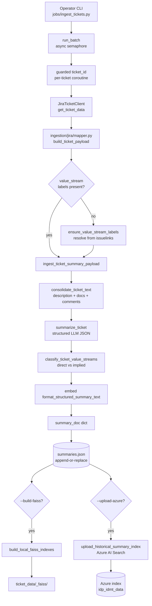
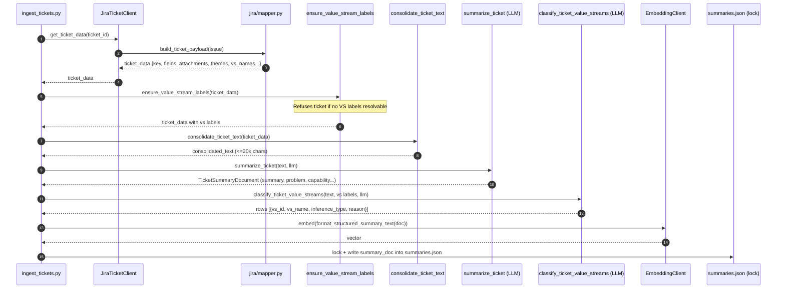
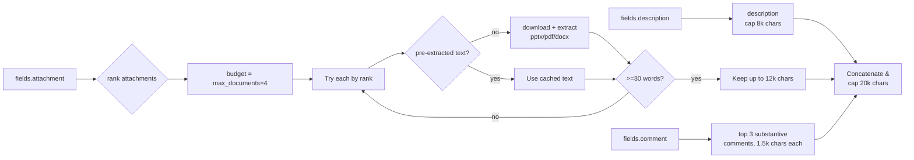
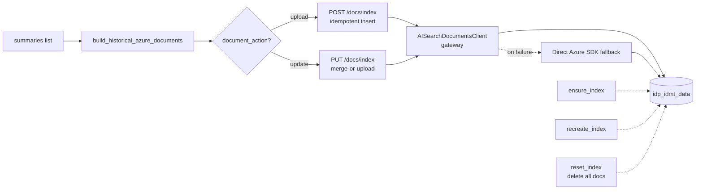
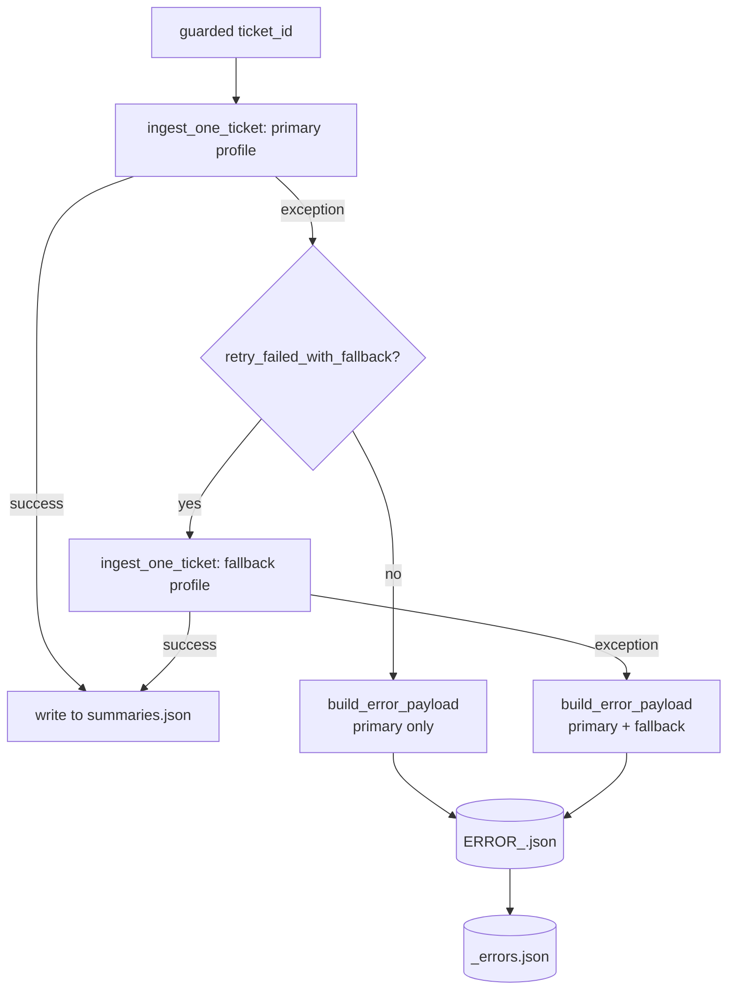

# Ingestion — End-to-End Reference

This document explains how the **Value Stream Ingestion pipeline** turns a
Jira idea-card ticket into the durable, searchable artifacts that power the
[Historical RAG](rag.md) pipeline. It covers every stage, every important
decision baked into the code, and the persistence sinks the system writes
to.

The companion document, [rag.md](rag.md), describes how those artifacts
are consumed at query time.

---

## 1. What ingestion produces

Ingestion has a single contract: for every Jira ticket processed, write
**one structured, embeddable, value-stream-labeled summary document** that
can be indexed by both FAISS (local) and Azure AI Search (production).

The output document (`TicketSummaryDocument`, defined in
[src/vs_app/modules/tickets/documents.py](../src/vs_app/modules/tickets/documents.py))
has this shape:

| Field                  | Origin                                                    | Purpose                                                  |
| ---------------------- | --------------------------------------------------------- | -------------------------------------------------------- |
| `ticket_id`            | Jira `key`                                                | Primary identifier                                       |
| `summary_text`         | LLM extraction (`retrieval_summary.yaml`)                 | 4–6 sentence dense semantic summary                      |
| `business_problem`     | LLM extraction                                            | Single-sentence pain point                               |
| `business_capability`  | LLM extraction                                            | Single-sentence "what the business must be able to do"   |
| `key_terms`            | LLM extraction                                            | Source-exact domain terms                                |
| `stakeholders`         | LLM extraction                                            | Affected groups (members, brokers, regulators, etc.)     |
| `systems_and_products` | LLM extraction                                            | Named systems/products/platforms                         |
| `value_stream_names`   | Jira issue-link resolution                                | Verified Jira **Theme → Value Stream** labels            |
| `value_stream_ids`     | Same                                                      | IDs parallel to the names                                |
| `jira_group_ids`       | Same                                                      | Jira group identifiers                                   |
| `label_source`         | Resolver decision                                         | Typically `jira_issuelinks`                              |
| `direct_vs_names`      | LLM classification (`value_stream_classification.yaml`)   | Streams **directly** impacted per the ticket text        |
| `implied_vs_names`     | Same                                                      | Streams impacted via downstream/upstream operations      |
| `value_streams`        | Same                                                      | Per-VS row: `{vs_id, vs_name, inference_type, reason}`   |
| `summary_embedding`    | Embedding client                                          | Vector built from the **formatted** summary text         |

> **Hard rule.** A ticket with no resolvable Jira Theme value-stream labels
> is **refused**. It will not be indexed and is recorded as an
> `ERROR_<id>.json`. See [jobs/ingest_tickets.py:468-471](../jobs/ingest_tickets.py#L468-L471).

---

## 2. High-level architecture



---

## 3. Entry points

Canonical ingestion code lives in [src/vs_app/ingestion](../src/vs_app/ingestion).
Importable batch-job code lives in [src/vs_app/jobs/jira_batch](../src/vs_app/jobs/jira_batch).
Root-level operator wrappers live in [jobs/](../jobs/).

The `IngestionService` facade is what the FastAPI route
[/ingestion/tickets/{ticket_id}](../src/vs_app/api/routes/ingestion.py)
calls. Route handlers never touch Jira, file extraction, or LLM calls
directly — they only call the service.

### Operator commands

```text
py -3 jobs/ingest_tickets.py IDMT-19761 IDMT-8199 --output-dir ticket_data --build-faiss --force
py -3 jobs/extract_tickets.py IDMT-19761 IDMT-8199 --output-dir jira_extraction
py -3 jobs/update_faiss_index.py --input-dir ticket_data --index-dir ticket_data/_faiss
```

- `ingest_tickets.py` — the **canonical** path. Builds historical-RAG
  summary docs and (optionally) the FAISS index and/or uploads to Azure.
- `extract_tickets.py` — debug path. Writes raw extraction JSON only.
- `update_faiss_index.py` — rebuilds FAISS from existing summary
  artifacts.

### Important flags on `ingest_tickets.py`

| Flag                          | Effect                                                                  |
| ----------------------------- | ----------------------------------------------------------------------- |
| `--input-ticket-ids FILE`     | Read IDs from text or JSON                                              |
| `--concurrency N`             | Per-batch semaphore (default 3)                                         |
| `--force`                     | Reprocess and overwrite tickets already in `summaries.json`             |
| `--aggregate-name NAME.json`  | Override aggregate filename                                             |
| `--no-embeddings`             | Skip vector embedding (FAISS will still build, Azure will embed inline) |
| `--build-faiss`               | Rebuild `ticket_data/_faiss` after summaries are written                |
| `--upload-azure`              | Push summaries to Azure AI Search                                       |
| `--create-azure-index`        | Create if missing                                                       |
| `--recreate-azure-index`      | **Delete and recreate**                                                 |
| `--reset-azure-index`         | Delete all docs (keep schema)                                           |
| `--azure-document-action`     | `upload` (POST, idempotent insert) or `update` (PUT, merge)             |
| `--azure-batch-size`          | Default 1000                                                            |

---

## 4. LLM runtime config — why two profiles

The batch wrapper bakes in a **two-profile retry policy**
([jobs/ingest_tickets.py:49-77](../jobs/ingest_tickets.py#L49-L77)):

```python
primary  = LlmRuntimeConfig(model="gpt-5-mini-idp",  effort="medium",
                            summary_input_chars=20_000,
                            classification_input_chars=20_000)
fallback = LlmRuntimeConfig(model="gpt-5-idp",       effort="low",
                            summary_input_chars=8_000,
                            classification_input_chars=6_000)
```

Why this exists:

- **Primary** is the cheap/stable pass on `gpt-5-mini-idp` with medium
  reasoning effort. The vast majority of tickets succeed here.
- **Fallback** retries failed tickets once on the larger `gpt-5-idp`, but
  with **smaller input windows**. Observation behind this: the IDP
  gateway has a short timeout for long-running chat calls, so giving the
  bigger model less text fits within the timeout while still recovering
  tickets the small model could not summarize.
- Any ticket that fails both passes is written to `ERROR_<id>.json` and to
  `_errors.json` with full tracebacks for both attempts.

The configuration that flows through the pipeline is
`JiraIngestionConfig`
([src/vs_app/jobs/jira_batch/config.py](../src/vs_app/jobs/jira_batch/config.py)).
Notable defaults:

| Field                                       | Default | Why                                                          |
| ------------------------------------------- | ------- | ------------------------------------------------------------ |
| `max_documents`                             | 4       | Hard cap on document attachments per ticket                  |
| `max_slides` / `max_pages`                  | 60      | Cap pptx slides / pdf pages                                  |
| `ocr_enabled`                               | True    | PDFs without text layer fall back to OCR                     |
| `max_prefetch_attachment_size`              | 60 MB   | Skip oversized files unless pre-extracted text exists        |
| `strict_value_stream_classification`        | True    | LLM **must** classify every label as direct or implied       |
| `enable_llm_prompt_sanitization_retry`      | True    | Sanitize safety-sensitive wording, then retry once           |

---

## 5. Per-ticket pipeline



### 5.1 Fetch & payload assembly

`JiraTicketClient.get_ticket_data`
([src/vs_app/integrations/jira/client.py](../src/vs_app/integrations/jira/client.py))
authenticates against Jira REST v2, requests a fixed list of fields
(`summary, description, reporter, assignee, created, updated, status,
priority, issuetype, labels, components, attachment, issuelinks, comment,
parent, subtasks`), and hands the raw issue JSON to
`build_ticket_payload`
([src/vs_app/ingestion/jira/mapper.py](../src/vs_app/ingestion/jira/mapper.py)),
which:

1. Extracts attachments (`fields.attachment`).
2. Runs `extract_themes(issuelinks)` to find implementation-style links to
   Jira "theme" issues.
3. Runs `resolve_value_streams(themes, issuelinks)` to convert those
   themes into canonical value-stream names and IDs.

The payload contract returned downstream is intentionally fixed:

```python
{
  "key": "IDMT-19761",
  "fields": {...raw Jira fields...},
  "attachments": [...],
  "themes": [...],
  "value_stream_names": [...],
  "value_stream_ids":   [...],
  "jira_group_ids":     [...],
  "value_stream_statuses": [...],
  "linked_value_streams": [...],
  "value_stream_label_source": "jira_issuelinks",
}
```

### 5.2 Label gate (refuse, don't guess)

`ensure_value_stream_labels`
([jobs/ingest_tickets.py:498](../jobs/ingest_tickets.py#L498)) gives the
resolver one more try directly against `issuelinks` if no labels came
back. If still empty, **the ticket is dropped**:

```python
raise RuntimeError(
    f"{ticket_id} has no official Jira Theme value-stream labels; "
    f"refusing to index unlabeled ticket"
)
```

This is deliberate: an unlabeled ticket would pollute historical retrieval
with unverifiable value-stream signal. The system is willing to lose
recall to keep precision.

### 5.3 Text consolidation

[src/vs_app/ingestion/summary/text_consolidator.py](../src/vs_app/ingestion/summary/text_consolidator.py)
turns the Jira payload into one consolidated text block that the LLM
summarizer will read.



Key decisions encoded in the consolidator:

- **Document budget = 4** by default. Anything beyond that is ignored.
- **Attachment ranking** (`_rank_document_attachment`):
  1. Filename contains `idea` or `card` (strong primary)
  2. Filename contains `business case`, `proposal`, `deck`, `initiative`
  3. Extension rank: `pptx` < `pdf` < `docx` < `ppt` < `doc`
  4. Smaller files first (treated as more concise idea cards)
  This biases consolidation toward the **idea card itself**, not 200-slide
  decks.
- **Supported attachment types**: `pptx`, `ppt`, `pdf`, `docx`, `doc`.
  Everything else is logged as "skipped unsupported".
- **Pre-extracted text reuse**: if Jira-side extraction already attached
  `extracted.text`, it's used as-is (saves a re-download and re-parse).
- **Weak-text rejection**: anything under 30 words is treated as junk
  (`_should_skip_extracted_text`) and the next-ranked attachment is
  tried.
- **Per-source caps**: description ≤ 8k, each document ≤ 12k, each
  comment ≤ 1.5k, total ≤ 20k chars. These caps keep prompt size stable
  for `gpt-5-mini-idp` while still leaving room for structured output.
- **Comments**: only the top 3 substantive comments are pulled; routine
  bot noise and acks are filtered out by `extract_substantive_comments`.
- **Size guard**: attachments with `size > max_prefetch_attachment_size`
  (60 MB) are skipped unless they have pre-extracted text.

### 5.4 Structured summarization (LLM #1)

[src/vs_app/ingestion/summary/llm_summary_extractor.py](../src/vs_app/ingestion/summary/llm_summary_extractor.py)
calls the LLM with the prompt defined in
[prompt_yaml/retrieval_summary.yaml](../prompt_yaml/retrieval_summary.yaml).
The contract is strict JSON conforming to `SummaryOutput`
(Pydantic model in `modules/prompts/schemas`).

Decisions baked into this step:

- **Temperature 0.2** — stable, near-deterministic extraction.
- **Required fields**: `summary_text`, `business_problem`, `business_capability`
  must all be non-empty; otherwise a `SummaryExtractionError` is raised,
  which triggers the fallback profile.
- **Content-filter retry**: clinical language ("suicide", "overdose",
  "kill", "abuse", "sexual", "pregnancy", etc.) is a common cause of
  safety-filter rejects when summarizing healthcare tickets. If the LLM
  error contains content-filter markers (`content filter`,
  `content_filter`, `response was filtered`, `prompt triggering`),
  `sanitize_for_llm_prompt` replaces the matching spans with neutral
  phrases like *"safety-sensitive care topic"*, *"behavioral health
  safety topic"*, *"mortality or severe-harm topic"*, *"family health"*,
  and the prompt is retried **once**. See the
  `_PROMPT_FILTER_REPLACEMENTS` table in
  [llm_summary_extractor.py:31-61](../src/vs_app/ingestion/summary/llm_summary_extractor.py#L31-L61).
- **Output token cap** defaults to 1,200 (configurable per profile).
- **Input character clamp** = `summary_input_char_limit` (default 20k for
  the primary profile, 8k for the fallback profile). Floor of 1k applied
  by `_input_char_limit` regardless of the configured value.

### 5.5 Direct/Implied classification (LLM #2)

The verified Jira value-stream labels are passed back to the LLM along
with the same consolidated text. The model must label each as **direct**
or **implied**.

Guarantees:

- **Closed set**. The LLM may not invent labels; outputs are matched
  against `normalized_names` (case-insensitive, whitespace-collapsed via
  `_normalize_name`). Unknown names are silently dropped.
- **No defaulting**. Reasons missing from the LLM response fall back to
  a fixed string ("Classified from ticket text and verified Jira
  value-stream labels.").
- **Strict completeness**. If `strict_value_stream_classification=True`
  (default) and any input label was not classified, the call raises
  `ValueStreamClassificationError` and the ticket fails. This forces the
  model to commit to every label.
- **Same sanitize-and-retry** safety-filter path as the summarizer.

The `direct_vs_names` / `implied_vs_names` arrays are derived from this
classification and persisted on the summary doc — the RAG side relies on
them.

### 5.6 Embedding

Once the doc is built, the embedding text is built from the
**structured** fields (`format_structured_summary_text` in
[src/vs_app/ingestion/summary/mapper.py](../src/vs_app/ingestion/summary/mapper.py)):

```text
{summary_text}
Problem: {business_problem}
Capability: {business_capability}
Stakeholders: {…}
Systems & Products: {…}
Key Terms: {…}
```

Embedding model defaults to `text-embedding-3-large` (configured via
`vs_app.settings.EMBEDDING_MODEL` / `EMBEDDING_DIMENSION`). The
`embed_batch` adapter
([integrations/embeddings/client.py](../src/vs_app/integrations/embeddings/client.py))
batches at 512 inputs and **returns zero-vectors on batch failure** to
avoid breaking the whole ticket on a single embedding-service hiccup
(the resulting empty `summary_embedding` is then handled gracefully by
Azure upload, which falls back to `embedding.embed(content)` inline).

The exact same `format_structured_summary_text` is used at query time for
FAISS document construction, so the embedded text in the index matches
what `_summary_text` builds in
[faiss_store.py](../src/vs_app/integrations/sinks/faiss_store.py) — and
matches what the RAG query side produces when the condense branch fires.

### 5.7 Aggregate write (crash-safe)

Inside `run_batch`, the aggregate file is updated under an `asyncio.Lock`
after each ticket succeeds:

```python
async with aggregate_lock:
    summaries_by_ticket[ticket_id] = summary
    write_summary_aggregate(aggregate_path, summaries_by_ticket.values())
```

This means a long batch left half-completed still leaves a usable
`summaries.json`. On a re-run without `--force`, completed tickets are
skipped at the per-ticket guard stage (avoiding even the Jira fetch).

---

## 6. Persistence sinks

After per-ticket processing, two optional persistence steps run.

### 6.1 Local FAISS

`build_local_faiss_indexes`
([src/vs_app/integrations/sinks/faiss_store.py](../src/vs_app/integrations/sinks/faiss_store.py))
builds **two** sibling indexes under `ticket_data/_faiss`:

```text
ticket_data/_faiss/
  summaries/          # FAISS index of TicketSummaryDocuments (primary)
    index.faiss
    index.pkl
  chunks/             # FAISS index of optional per-document chunks
    index.faiss
    index.pkl
  summary_docs.json           # raw summary rows
  skipped_summary_docs.json   # rows we refused to index, with reason
  chunk_docs.json
  manifest.json               # build metadata + ID list
```

Each indexed summary becomes a LangChain `Document` whose `metadata`
carries the full label set needed at retrieval time:

```python
{
  "doc_type": "summary",
  "ticket_id": "IDMT-19761",
  "value_stream_names": [...],
  "value_stream_ids":   [...],
  "direct_vs_names":    [...],
  "implied_vs_names":   [...],
  "label_source":       "jira_issuelinks",
}
```

The retriever
([modules/rag/retrieval/historical_retriever.py](../src/vs_app/modules/rag/retrieval/historical_retriever.py))
reads exactly this metadata to compute value-stream support.

**Similarity at query time** uses
`similarity = 1.0 / (1.0 + raw_distance)` — FAISS returns squared L2
distance for OpenAI embeddings, and the system normalizes scores into a
`[0, 1]` band so the rest of the pipeline can reason about thresholds
uniformly (`historical_support_weight` in the merger expects similarity,
not distance).

**Resilient path resolution** — `search_local_faiss` is tolerant about
where callers point `index_dir`: it accepts the FAISS root, the concrete
`summaries`/`chunks` directory, or a path relative to the repo root, and
checks for the presence of both `index.faiss` and `index.pkl` before
deciding the index is usable.

### 6.2 Azure AI Search (production index)

[src/vs_app/ingestion/persistence/azure_historical_index.py](../src/vs_app/ingestion/persistence/azure_historical_index.py)
defines the production index schema and upload routines.



Schema highlights (`ensure_historical_summary_index`):

- `id` (key) — base64-urlsafe encoded ticket id (Azure keys disallow
  several characters that legitimately appear in ticket ids, so the id is
  encoded; `ticket_id` itself is preserved as a separate filterable
  field).
- `ticket_id` — filterable, sortable
- `content` — the `format_structured_summary_text(...)` blob, searchable
- `content_vector` — HNSW vector field with the embedding from ingestion
  (re-embedded inline by `embedding.embed(content)` if missing)
- Searchable text fields: `summary_text`, `business_problem`,
  `business_capability`
- Faceted/filterable string collections: `key_terms`, `stakeholders`,
  `systems_and_products`, `value_stream_names`, `value_stream_ids`,
  `jira_group_ids`, `direct_vs_names`, `implied_vs_names`
- `value_streams_json` — searchable string holding the structured per-VS
  classification rows; the RAG retriever parses this back out for
  `inference_type` and `reason`
- `label_source` — filterable

Operational decisions:

- **Gateway-first with SDK fallback**. The upload first goes through the
  `AISearchDocumentsClient` (IDP-internal AI Search documents gateway).
  If it fails for any reason, the code automatically falls back to the
  direct `azure-search-documents` SDK (`AzureDirectSearchClient`) — for
  `update`, this becomes `merge_or_upload_documents`. This fallback is
  deliberate: gateway outages should not block ingestion.
- **`upload` vs `update`**. First-time runs use `upload` (POST).
  Re-ingests of existing tickets use `update` (PUT / merge-or-upload).
  The gateway accepts both, but `upload` is cheaper and atomic.
- **`recreate_index`** drops and recreates the index. Use only when
  changing the schema; it loses all data.
- **`reset_index`** deletes documents while keeping the schema. Useful
  when re-ingesting a fixed set.
- **`ensure_index`** is non-destructive — if the index already exists, it
  only extends the schema with missing fields and (re-)attaches the
  vector-search configuration.
- **Authentication** is service-principal via `ClientSecretCredential`
  built from `AZURE_TENANT_ID`, `AZURE_CLIENT_ID`, `AZURE_CLIENT_SECRET`
  in `vs_app.settings`.

### 6.3 Aggregate file (`summaries.json`)

```json
{
  "total": 42,
  "summaries": [
    { "ticket_id": "IDMT-19761", "summary_text": "...", ... },
    ...
  ]
}
```

The FAISS builder accepts three shapes for backward compatibility:

- `ticket_data/summaries.json` (canonical)
- `ticket_data/_all_summaries.json` (legacy)
- `ticket_data/<ticket-id>/summary.json` (one-file-per-ticket legacy)

---

## 7. Concurrency model

The batch wrapper uses a simple `asyncio.Semaphore(concurrency)` (default
3). That number trades off:

- **Jira REST rate limits**. The Jira tenant tolerates a few concurrent
  fetches per token; pushing above ~5 reliably starts returning 429s.
- **LLM gateway throughput**. `gpt-5-mini-idp` has per-tenant concurrency
  caps; 3 in-flight requests is the sweet spot.
- **Memory**. Each in-flight ticket can hold up to 20k chars of text plus
  a 60 MB attachment download.

The aggregate write is serialized through an `asyncio.Lock` so two
coroutines never race on `summaries.json`.

---

## 8. Failure handling



`build_error_payload` captures, per attempt: model name, reasoning
effort, input-character limits, exception type, stringified error, and
the full traceback. This makes triage from a partial batch
straightforward — open `_errors.json`, group by `primary.exception_type`,
fix root cause, re-run with `--force` only for the affected ids.

---

## 9. Operator quick reference

```text
# Single ticket, FAISS only:
py -3 jobs/ingest_tickets.py IDMT-19761 --build-faiss

# Force re-ingest a list and push to Azure:
py -3 jobs/ingest_tickets.py --input-ticket-ids tickets.txt \
    --concurrency 4 --force --upload-azure --azure-document-action update

# Skip embeddings (FAISS will still embed at index time; Azure will too):
py -3 jobs/ingest_tickets.py IDMT-19761 --no-embeddings

# Recreate the Azure index with the current schema (DANGER: drops data):
py -3 jobs/ingest_tickets.py --upload-azure --recreate-azure-index
```

The output directory at the end of a successful batch looks like:

```text
ticket_data/
  summaries.json          # aggregate of all good summaries
  ERROR_IDMT-XXXXX.json   # per-ticket error payloads (if any)
  _errors.json            # combined error list
  _faiss/                 # local FAISS (if --build-faiss)
    summaries/
    chunks/
    summary_docs.json
    skipped_summary_docs.json
    chunk_docs.json
    manifest.json
```

---

## 10. Why these decisions, in one line each

- **Refuse unlabeled tickets** → keep historical-RAG precision; recall
  can be recovered later.
- **Two-profile retry** → mini-model survives most tickets; bigger model
  with smaller context catches the rest within the gateway timeout.
- **Closed-set classification with strict completeness** → prevents the
  LLM from drifting outside the verified label set or quietly dropping a
  label.
- **Filename-ranked attachment selection** → biases consolidation toward
  the idea card itself rather than supplementary decks.
- **Pre-extracted text reuse** → avoids re-downloading & re-parsing
  multi-megabyte attachments on re-ingest.
- **Sanitization retry for clinical wording** → healthcare tickets
  routinely trip safety filters; redacting before retry saves real
  tickets.
- **Lock-protected aggregate write** → a half-finished batch still
  leaves a usable artifact.
- **Gateway-first / SDK-fallback for Azure** → ingestion completes even
  when the AI Search gateway is degraded.
- **Same `format_structured_summary_text` for embedding and query-side
  formatting** → retrieval distance reflects how documents will actually
  be presented to downstream LLM calls.
- **Zero-vector embedding fallback in `embed_batch`** → a single
  embedding-service hiccup doesn't fail a whole batch; the row is still
  written with an empty vector and Azure re-embeds inline on upload.
- **base64-urlsafe document keys** → Azure key constraints don't force
  ticket-id renaming; `ticket_id` stays its natural form on the document.
