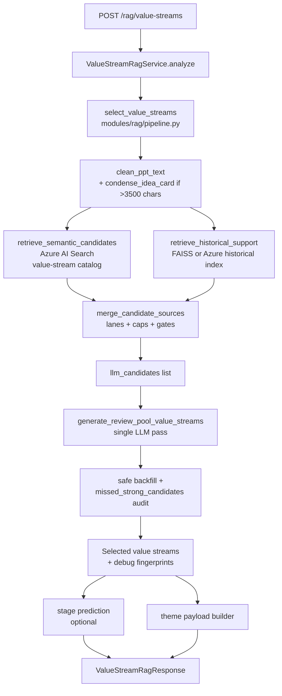
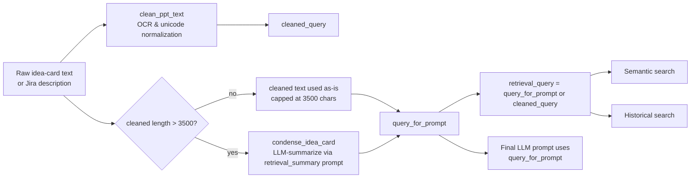
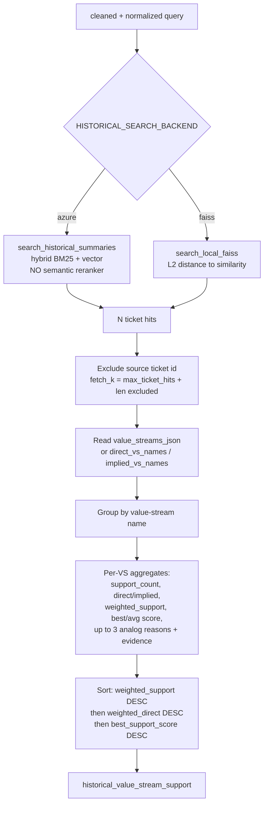
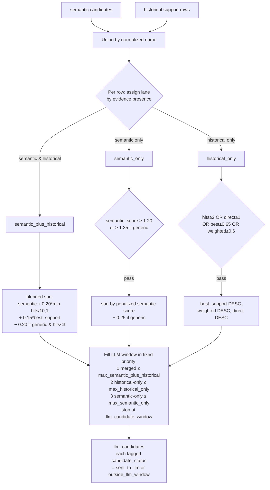
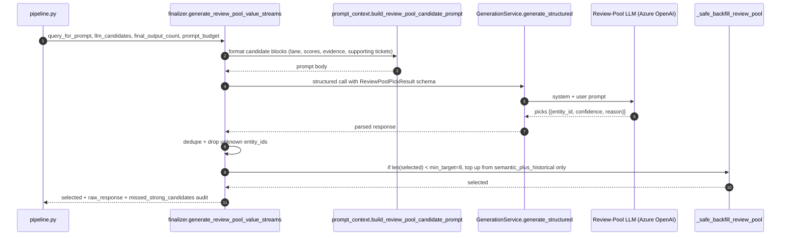
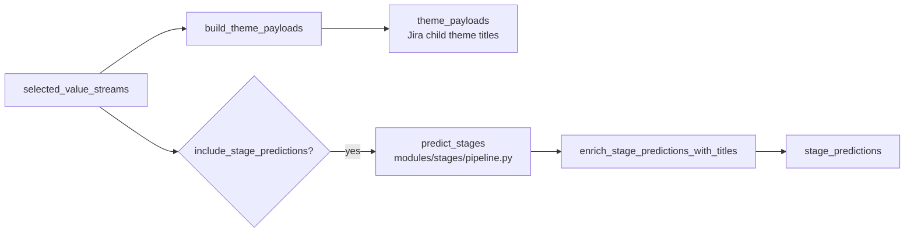

# RAG — End-to-End Reference

This document explains the **Historical RAG pipeline** that predicts which
healthcare value streams an idea card impacts. It covers the public API
surface, every retrieval and merge stage, the LLM finalizer prompt
contract, the scoring math, and the runtime knobs.

Companion document: [ingestion.md](ingestion.md) — how the artifacts that
this pipeline reads are built.

Canonical RAG code lives in [src/vs_app/modules/rag](../src/vs_app/modules/rag).

---

## 1. What this RAG pipeline does

Given an idea-card text blob (or a Jira ticket id whose attached idea card
gets extracted automatically), the pipeline:

1. Cleans and (when long) condenses the idea card into a retrieval-friendly form.
2. Retrieves **candidate value streams** from the Azure-based ValueStream
   catalog (semantic).
3. Retrieves **historical analog tickets** from the historical summary index
   (FAISS or Azure) and turns them into per-value-stream evidence.
4. Merges the two evidence sources into a **bounded LLM candidate window**
   with lane-based gates.
5. Hands the candidates and the idea card to a **single Review-Pool LLM
   call** which picks the final value streams with confidences and rationales.
6. Optionally runs **stage prediction** and builds **theme payloads**.

The pipeline does **not** expose plain semantic, plain combined, or
classic-style RAG modes publicly. The only public modes are:

| Method | Path                              | Use                                                       |
| ------ | --------------------------------- | --------------------------------------------------------- |
| POST   | `/rag/value-streams`              | Synchronous response                                      |
| POST   | `/rag/value-streams/stream`       | Server-Sent Events: streams progress + final result       |

---

## 2. Public API

Two routes are exposed by [src/vs_app/api/routes/rag.py](../src/vs_app/api/routes/rag.py).
The SSE route emits `step`, `result`, or `error` events — useful for UIs
that want to show "Searching value-stream catalog…", "Searching historical
analogs…", "Running Review Pool LLM…" inline.

Both routes call the **service facade** `ValueStreamRagService.analyze`
([src/vs_app/modules/rag/service.py](../src/vs_app/modules/rag/service.py)) —
they never call the pipeline directly. The route is responsible for:

- Resolving the idea-card text (from the request body, or by extracting from
  the local `idea_cards/` directory if only a ticket id is supplied).
- Looking up ground truth (for evaluation) from FAISS or Azure.
- Wiring extraction-debug info into the response.
- Optionally calling `predict_stages(...)` and `build_theme_payloads(...)`
  to enrich the result with stage predictions and Jira-theme child-titles.

---

## 3. Architecture overview



The whole pipeline is implemented synchronously inside one Python function,
`select_value_streams`
([src/vs_app/modules/rag/pipeline.py](../src/vs_app/modules/rag/pipeline.py)).
It is invoked via `asyncio.to_thread` from the route so the FastAPI event
loop stays responsive.

---

## 4. Query preparation



Decisions baked into
[modules/rag/query/views.py](../src/vs_app/modules/rag/query/views.py):

- **`clean_ppt_text`** removes PowerPoint OCR artifacts and unicode noise that
  otherwise dominate similarity search. The underlying cleaner
  ([shared/text_cleaning.py:clean_extracted_text](../src/vs_app/shared/text_cleaning.py#L147))
  does, in order: literal-escape unescape (`\\n`, `\\t`, `\\x00`), Unicode
  NFKC normalization, bullet/dash/quote unification (`•`, `–`, `"`, etc. →
  ASCII), strip zero-width and control chars, **`undouble_alpha_runs`**
  (`DDAATTAA` → `DATA`, common PDF-OCR doubling), **`_despace_spelled_words`**
  (`D a t a` → `Data` when every piece ≤2 chars), drop sparse `|` table rows
  and table separators, strip slide-number/proprietary boilerplate, and
  collapse multispace.
- **`condense_idea_card` short-circuits at 3500 chars.** If the cleaned text
  is ≤ 3500 chars, the cleaned text itself is returned (no LLM call). Above
  the threshold, the LLM is called with the same prompt that ingestion uses,
  producing a structured-summary blob. The threshold is the `max_chars=3500`
  argument to
  [`condense_idea_card_with_metadata`](../src/vs_app/modules/rag/query/views.py#L109).
- **Hard input cap to the condense LLM = 8000 chars**
  ([views.py:116](../src/vs_app/modules/rag/query/views.py#L116) —
  `cleaned[:8000]`). A 200-page deck is truncated to its first ~8k chars
  before the LLM ever sees it. The condensed output is then capped to
  `max_chars=3500` via `format_structured_summary_text(parsed, max_chars=…)`.
- **Condense uses the same prompt as ingestion** (`retrieval_summary.yaml`) so
  the condensed query has the same shape as the documents in the index.
  Three-way symmetry: `format_structured_summary_text` flattens (a) the LLM
  output at ingestion into `content`, (b) the FAISS `page_content`, and (c)
  the condensed query text — so query, BM25 target, and embedded target all
  agree token-for-token when this branch fires.
- The condense model defaults to `gpt-5-mini-idp` with reasoning effort
  `low` (env-overridable via `CONDENSE_LLM_MODEL` /
  `CONDENSE_LLM_REASONING_EFFORT`). Cheap, fast, deterministic.
- **`normalize_for_search`**
  ([views.py:41](../src/vs_app/modules/rag/query/views.py#L41)) further
  lowercases, strips characters outside
  `[a-z0-9\n.,/\-&$+ ]+`, collapses multispace, and caps to 2500 chars.
- **`_semantic_search_query`**
  ([semantic_retriever.py:91](../src/vs_app/modules/rag/retrieval/semantic_retriever.py#L91))
  then tokenizes the normalized text, **drops single-character tokens**,
  **deduplicates** while preserving order, and **caps to 90 unique terms**
  before joining back. Why: Azure's `searchMode=any` BM25 with raw long
  queries returns noisy hits; pruning to high-signal tokens improves
  precision at zero retrieval-side cost.

---

## 5. Retrieval — semantic candidates (value-stream catalog)

[retrieve_semantic_candidates](../src/vs_app/modules/rag/retrieval/semantic_retriever.py)
queries the Azure ValueStream catalog directly (not the historical index):

```python
client.search_hybrid(
    _semantic_search_query(query),
    top_k=search_top_k,
    use_semantic_rerank=True,
    filter_expression="node_type eq 'ValueStream'",
    search_fields=["entity_name", "content"],
)
```

- **Index targeted:** `VALUE_STREAM_AZURE_SEARCH_INDEX_NAME`
  (default `value-streams`), filtered to value-stream rows only.
- **Hybrid = BM25 + vector + semantic reranker** all in one Azure call.
  Reciprocal-Rank-Fusion blends the BM25 and vector hits before the semantic
  reranker re-orders them. Falls back to **pure vector search**
  (`client.search_vector(...)`) if hybrid fails.
- **Top-k = `semantic_fetch_k = 60`** (fixed by `derive_rag_runtime_config`;
  intentionally not shrunk by the requested output count — retrieval is
  cheap, the output slider should only narrow the *result*).
- **`allowed_value_stream_names` filter**, when supplied, doubles the fetch
  size (`min(100, max(top_k, top_k*2))`) to compensate for the post-filter
  drop, then keeps only rows whose normalized name is in the allowed set.
- **Score selection:** the reranker score is preferred over the raw search
  score (`@search.reranker_score` → `@search.score`). Both are preserved on
  every hit by `AzureDirectSearchClient._collect`.
- **Dedupe key:** prefers `entity_id`, falls back to normalized
  `entity_name`. Higher score wins on collision.

### What query tokens land on

The query is one blob. Azure tokenizes it and matches each token against
each field in `search_fields`. On the VS catalog there are only two
useful fields:

| Field         | Type         | How it contributes                                  |
| ------------- | ------------ | --------------------------------------------------- |
| `entity_name` | Searchable   | BM25 — short, so literal VS-name mentions matter    |
| `content`     | Searchable   | BM25 — the VS description                           |
| `content_vector` | Vector field (HNSW) | Embedded query vs. embedded VS content (cosine) |

Other catalog fields (`node_id`, `entity_id`, `properties`) are part of the
default `select`, not `search_fields`, so they're returned but not matched
against.

Each row produced for the merger:

```python
{
  "entity_id":      "...",
  "entity_name":    "Manage Member Care",
  "description":    "...",
  "semantic_score": 1.4321,   # reranker score, or @search.score if no rerank
  "from_semantic":  True,
  "from_historical": False,
}
```

---

## 6. Retrieval — historical support (idp_idmt_data / FAISS)



Implemented in
[modules/rag/retrieval/historical_retriever.py](../src/vs_app/modules/rag/retrieval/historical_retriever.py).

### What query tokens land on (historical Azure backend)

```python
client.search_hybrid(
    query,
    vector_field="content_vector",
    search_fields=["content", "summary_text", "business_problem", "business_capability"],
    use_semantic_rerank=False,
)
```

| Field                  | Type                  | How it contributes                                            |
| ---------------------- | --------------------- | ------------------------------------------------------------- |
| `content`              | Searchable            | BM25 over the full formatted summary blob                     |
| `summary_text`         | Searchable            | BM25 — also independently indexed (double-counts vs `content`)|
| `business_problem`     | Searchable            | BM25 — same double-count effect                               |
| `business_capability`  | Searchable            | BM25 — same                                                   |
| `content_vector`       | Vector (HNSW)         | Cosine of embedded query vs. embedded `content` (which encodes summary + problem + capability + stakeholders + systems + key_terms) |
| `key_terms`, `stakeholders`, `systems_and_products` | Filterable collections | **Not in `search_fields`** — present only via `content` BM25 and via the vector |
| `value_stream_names`, `value_stream_ids`, `direct_vs_names`, `implied_vs_names`, `jira_group_ids` | Filterable collections | Used **after** retrieval to compute per-VS support |
| `value_streams_json`   | Searchable            | The structured per-VS rows; parsed for inference_type + reason|
| `label_source`         | Filterable            | Used for `historical_evidence` provenance display             |

Three things to know about the historical lane:

1. **No semantic reranker** (`use_semantic_rerank=False`) — multi-field
   BM25 + vector is enough signal; reranker would mostly add latency.
2. **Three fields appear "twice" on the BM25 side.** `summary_text`,
   `business_problem`, `business_capability` are indexed both as their own
   `Searchable` fields *and* embedded inside the combined `content` field.
   A query token hitting them lands on both — implicitly weighting those
   three facets above stakeholders / systems / key_terms.
3. **The vector covers everything.** `content_vector` was built at
   ingestion from `format_structured_summary_text(doc)`, which combines
   summary + problem + capability + stakeholders + systems + key_terms.
   Dense similarity sees all six facets at once.

### FAISS backend

`search_local_faiss`
([integrations/sinks/faiss_store.py:83](../src/vs_app/integrations/sinks/faiss_store.py#L83))
runs `vectorstore.similarity_search_with_score(query, k=top_k)` against the
`ticket_data/_faiss/summaries` index. The raw L2 distance is converted to a
[0, 1] similarity band:

```python
similarity = 1.0 / (1.0 + raw_distance)
```

All FAISS metadata (value-stream label arrays, `label_source`, etc.) was
written at ingestion time and is read straight off the LangChain
`Document.metadata`.

### Exclusion-aware fetch

When the request supplies a `ticket_id`, the pipeline passes
`exclude_ticket_ids=[<that id>]` so the system doesn't recommend a ticket
against itself. To keep the effective `max_ticket_hits` constant after the
filter, the retriever bumps `fetch_k = max_ticket_hits + len(excluded)`
before truncation. Ticket-id matching uses a regex
(`[A-Z][A-Z0-9_]*-\d+`, uppercase-normalized) so it tolerates
embedded-prefix strings like `URL:.../IDMT-19761` in either side.

### Value-stream extraction from hits

Two paths, in order:

1. **`_extract_structured_value_stream_support`** — if the hit has a
   `value_streams_json` field (the structured per-VS rows written by
   ingestion), it is JSON-parsed and used directly. Each row gives
   `inference_type` ("direct" or "implied", normalized lowercase) and an
   optional `reason`. Dedupes by `(name_lower, inference_type)`.
2. **Fallback** — combine `direct_vs_names` and `implied_vs_names` from
   metadata. Names appearing in both arrays are kept only in the direct
   set; everything else is implied.

### Per-ticket weight & aggregation

```python
per_ticket_weight = 1.0 / max(n_streams_on_ticket, 1)
```

So a ticket tagged with 5 value streams contributes 1/5 weight to each;
a ticket tagged with 1 stream contributes 1.0. This prevents
broadly-tagged historical tickets from dominating any one stream's
support.

For each value stream the retriever aggregates:

| Field                       | Definition                                                       |
| --------------------------- | ---------------------------------------------------------------- |
| `support_count`             | Raw count of supporting tickets                                  |
| `direct_count` / `implied_count` | Split by inference type                                     |
| `weighted_support_count`    | Σ per-ticket weights                                             |
| `weighted_direct_count` / `weighted_implied_count` | Same split                              |
| `best_support_score`        | Max similarity over supporting tickets                           |
| `avg_support_score`         | Mean similarity over supporting tickets                          |
| `supporting_ticket_ids`     | Unique ticket ids (insertion order)                              |
| `label_sources`             | Unique `label_source` values across supporting tickets           |
| `historical_reasons`        | ≤ 3 strings: `[<ticket-id> / <direct\|implied>] <preview \| classifier reason \| functions>` |
| `historical_evidence`       | ≤ 3 structured rows (ticket_id, title, summary_preview, inference, reason, function arrays) |

Final sort key (descending): `weighted_support_count` →
`weighted_direct_count` → `best_support_score`. This intentionally favors
streams with **many, direct, high-similarity** analogs over streams with
one strong match.

---

## 7. Merging into the LLM candidate window

[merge_candidate_sources](../src/vs_app/modules/rag/augmentation/candidate_merger.py)
is where evidence quality is enforced.



### Lane assignment

```python
if from_semantic and from_historical: "semantic_plus_historical"
elif from_semantic:                   "semantic_only"
elif from_historical:                 "historical_only"
else:                                 "unknown"
```

Pure evidence-presence — score thresholds do not move a candidate between
lanes.

### Lane gates

- **`historical_only`** is kept only when **at least one** of:
  - `support_count ≥ 2`,
  - `direct_count ≥ 1`,
  - `best_support_score ≥ 0.65`,
  - `weighted_support ≥ 0.6`.
  Thin historical-only candidates introduced noise without recall benefit
  in evaluation.
- **`semantic_only`** is kept only when `semantic_score ≥ 1.20`, raised to
  `≥ 1.35` for streams in `GENERIC_OR_RISKY_STREAMS`.
- **`semantic_plus_historical`** has no hard gate — having any evidence on
  both sides is itself a signal.

### `GENERIC_OR_RISKY_STREAMS`

Streams that historically false-positive due to broad wording overlap with
many idea cards. They are never banned — strong evidence still surfaces
them — but they get a sort penalty so they don't crowd out
stream-specific candidates in lane caps. Full list from
[candidate_merger.py:15-25](../src/vs_app/modules/rag/augmentation/candidate_merger.py#L15-L25):

- *Discover Business Insights*
- *Promote Community Health*
- *Administer Quality Management Program*
- *Receive Care*
- *Adjudicate Claim*
- *Fill and Manage Prescriptions*
- *Manage Producer Operations*
- *Align and Execute IT Strategy*
- *Develop Mission, Vision, and Strategy*

### Sort formulas

**Merged lane (`semantic_plus_historical`):**

```python
historical_boost = min(1.0, hits / 10.0) * 0.20 + best_support * 0.15
blended = semantic_score + historical_boost
if name in GENERIC_OR_RISKY_STREAMS and hits < 3:
    blended -= 0.20
# tuple sort key (descending in each):
(-blended, -semantic, -best_support, -weighted_support, -hits, name_lower)
```

Why blend: a candidate with a marginally better semantic score but a single
thin historical hit shouldn't bury a candidate with 10 coherent analogs.
Why saturate at 10 hits: diminishing returns and the boost should be
comparable in magnitude to `semantic_score` (typically 0.5–2.0).

**Semantic-only:**

```python
penalty = 0.25 if name in GENERIC_OR_RISKY_STREAMS else 0.0
sort_key = (-(semantic_score - penalty), name_lower)
```

**Historical-only:**

```python
sort_key = (-best_support, -weighted_support, -direct_count,
            -support_count, -implied_count, -avg_support, name_lower)
```

### Window-filling priority

The LLM window is filled in **strict priority order** (never round-robin),
each capped:

1. Merged candidates, up to `max_semantic_plus_historical`.
2. Evidence-qualified `historical_only`, up to `max_historical_only`.
3. Gate-passing `semantic_only`, up to `max_semantic_only`.

Stops at `llm_candidate_window`. This protects merged candidates from
being crowded out by high-scoring but evidence-thin semantic-only
candidates.

### Caps

| Cap                                       | Default                                   | Why                                              |
| ----------------------------------------- | ----------------------------------------- | ------------------------------------------------ |
| `max_semantic_plus_historical`            | `= llm_candidate_window` (no quota)       | The strongest lane fills the window if it can    |
| `max_historical_only`                     | `clamp(floor(window * 0.16), 4, 8)`       | ≈16% of window                                   |
| `max_semantic_only`                       | `clamp(window − merged − hist, 1, 5)`     | Most false-positive-prone lane, kept small       |
| `max_supporting_tickets_per_candidate`    | 2                                         | Bounds the per-candidate evidence shown to LLM   |

### Fallback weight for historical rows lacking `weighted_support`

If a historical-support row doesn't already carry a weighted-support number
(e.g. from a legacy backend), the merger fabricates one with a quantized
weight function
([candidate_merger.py:249](../src/vs_app/modules/rag/augmentation/candidate_merger.py#L249)):

```python
def historical_support_weight(score: float) -> float:
    if score >= 0.80: return 1.0
    if score >= 0.70: return 0.6
    if score >= 0.60: return 0.3
    return 0.0
```

Then `weighted_support = round(weight * supporting_ticket_count, 4)`.
Tickets with similarity below 0.60 contribute zero. This is only the
fallback path — the live historical retriever already supplies a proper
`weighted_support_count` from the 1/n-streams rule above.

### Candidate-status tagging

Every merged candidate (whether sent or not) is tagged so the response is
auditable:

| Field                       | Value when sent          | Value when dropped         |
| --------------------------- | ------------------------ | -------------------------- |
| `candidate_status`          | `sent_to_llm`            | `outside_llm_window`       |
| `candidate_status_reason`   | `within_candidate_window`| `lane_window_cap`          |

---

## 8. The Review-Pool LLM call



### 8.1 Prompt construction

`build_review_pool_candidate_prompt`
([modules/rag/augmentation/prompt_context.py](../src/vs_app/modules/rag/augmentation/prompt_context.py))
produces per-candidate blocks of the form:

```text
1. <Entity Name>
Entity ID: <entity_id>
Lane: semantic_plus_historical
Description: <first 100 chars>
Semantic score: 1.4321
Historical: 4 tickets (2 direct, 2 implied), best 0.812, avg 0.711, weighted 1.350
Supporting tickets: IDMT-...,IDMT-...
Evidence:
- IDMT-XXXX / direct: <title>
  Why this stream: <classifier reason>
  Prior ticket summary: <preview>
  Supporting functions: direct functions: ...; implied functions: ...
```

Ordering is **inherited from the merger** (`candidate_merger.py` already
sorted merged → historical-only → semantic-only). The prompt builder does
not re-order; doing so would undo the lane priority logic.

The block budgets come from the runtime config
([modules/rag/config/runtime.py](../src/vs_app/modules/rag/config/runtime.py)):

| Budget                                | Default | Env override                                |
| ------------------------------------- | ------- | ------------------------------------------- |
| `idea_card_prompt_chars`              | 1800    | `RAG_IDEA_CARD_PROMPT_CHARS`                |
| `candidate_description_chars`         | 100     | `RAG_CANDIDATE_DESCRIPTION_CHARS`           |
| `analogs_per_candidate`               | 2       | `RAG_ANALOGS_PER_CANDIDATE`                 |
| `analog_chars`                        | 80      | `RAG_ANALOG_CHARS`                          |
| `historical_ticket_ids_per_candidate` | 2       | `RAG_HISTORICAL_TICKET_IDS_PER_CANDIDATE`   |

Idea-card text is clipped to `idea_card_prompt_chars` independently of how
long the condensed query is. Evidence ordering inside each candidate block:
**direct evidence first, then implied** (`_ordered_historical_evidence`,
`_ordered_analog_reasons`).

### 8.2 System prompt — what the model is told

[prompt_yaml/review_pool_selection.yaml](../prompt_yaml/review_pool_selection.yaml)
is the single source of truth. Key contractual points:

- **The requested final count is an upper bound, not a target.** The model
  must return fewer than `max_select` if fewer candidates are defensible
  and **must not pad**.
- **Output is `entity_id`, `confidence`, and a short business reason
  only.** Names and descriptions are filled downstream from `entity_id`.
  This protects against the LLM inventing names that don't exist in the
  catalog.
- **Direct vs. implied operational impact reasoning.** The prompt
  explicitly guides the model to include downstream/upstream operational
  streams even when the idea card does not name them, listing reasoning
  categories (product setup, benefit design, claims, payment, compliance,
  outreach, etc.) as *examples* — not automatic selections.
- **False-positive guard.** Generic terms (member, provider, health, data,
  platform, strategy, implementation, operations) must not drive selection
  on adjacency alone.
- **Confidence bands.** 0.85+ direct, 0.70+ strong implied, 0.45+
  defensible indirect, 0.30+ weak but defensible.
- **No score language in reasons.** The model is told not to cite scores,
  ranks, lane names, or support counts.

### 8.3 Structured output

```python
result = GenerationService().generate_structured(
    query=prompt,
    output_schema=ReviewPoolPickResult,       # picks: list[ReviewPoolPick]
    system_prompt=system_prompt,
    reasoning_effort=REVIEW_POOL_REASONING_EFFORT,  # default "low"
)
```

The reasoning effort defaults to `low` (env-overridable via
`REVIEW_POOL_REASONING_EFFORT`). Low effort is enough here because the
candidate list has already been pre-filtered by retrieval and lane gates.

After the call, the finalizer:

1. Builds an id-lookup over the candidate list.
2. Iterates the picks, normalizing each `entity_id` to lowercase trimmed
   form and **dropping unknown ids with a warning**.
3. Deduplicates by id within the picks.
4. Truncates to `requested` (= `final_output_count`).

Selected rows are built by `_build_selected_row` and tagged
`selection_source = "llm_pick"`. Confidence is clamped to `[0, 1]`.

If the LLM call itself raises (gateway error, timeout), the finalizer
**catches** and proceeds with an empty picks list — `_safe_backfill_review_pool`
then attempts to recover.

### 8.4 Safe backfill

`_safe_backfill_review_pool` exists for the case where the LLM selects
unusually few picks (including the LLM-failure case). It tops the
selection up to **`min(requested, 8)`**, but only from
`semantic_plus_historical` candidates with either a decent semantic score
(`≥ 1.05`) or repeated historical evidence (`hits ≥ 3`). Filler rows are
marked `selection_source = "safe_backfill"` with confidence 0.35 so
downstream filters can identify them.

Backfill iteration order
([finalizer.py:627-645](../src/vs_app/modules/rag/augmentation/finalizer.py#L627-L645)):

```python
sorted_by(
  lane_priority {semantic_plus_historical:0, semantic_only:1, historical_only:2},
  -ranking_score,
  -semantic_score,
  -best_support_score,
  -supporting_ticket_count,
)
```

The lane filter then restricts to `semantic_plus_historical` only, so the
ordering on the other lanes is moot — but the same sort is reused by other
audit functions.

A full backfill to the requested count is **not** done — that previously
dragged precision down by padding with weak semantic-only candidates.

### 8.5 Reason rewriting

If the LLM-supplied reason leaks score language ("semantic score X",
"support count Y", "ranking", "best support", "similarity", "score:"…),
`_business_reason_for_candidate` substitutes a business-flavored sentence
built from the candidate description plus the strongest analog summary
([finalizer.py:735-749](../src/vs_app/modules/rag/augmentation/finalizer.py#L735-L749)).
Three branches:

1. Have both description and analog summary → "Selected because the idea
   card aligns to {desc}. Similar prior work shows the same pattern:
   {analog}."
2. Have only description → "Selected because the idea card aligns to
   {desc}."
3. Have only an analog → "Selected because similar prior work shows
   {name} recurring in the same business pattern: {analog}."
4. Otherwise → fixed fallback string.

The model is instructed not to cite scores, but this is the safety net.

### 8.6 Missed-strong-candidate audit

`_missed_strong_candidates` flags any candidate that **was sent to the LLM
but not selected** if any of these hold:
`lane == "semantic_plus_historical"`, `semantic_score ≥ 1.20`,
`supporting_ticket_count ≥ 5`, or `best_support_score ≥ 0.70`. The list is
attached to `raw_response.missed_strong_candidates` for eval / QA review —
it doesn't change selection, only surfaces "the model probably should have
picked this".

### 8.7 Legacy `sanitize_selected` (defense-in-depth)

The deprecated two-pass path in `generate_value_streams` runs
[`sanitize_selected`](../src/vs_app/modules/rag/ranking/reranker.py)
to coerce LLM-returned names back to valid candidates with a four-step
ladder: `entity_id` exact → exact name → normalized name → fuzzy
`SequenceMatcher` ratio ≥ 0.75. The current single-pass review pool relies
on structured-output schema instead, but `sanitize_selected` is still in
the tree and re-used by `_run_selection_pass`.

---

## 9. Runtime configuration

The single runtime config is built by `derive_rag_runtime_config`
([modules/rag/config/runtime.py](../src/vs_app/modules/rag/config/runtime.py)):

```python
final_output_count        = max(1, requested or 12)
semantic_fetch_k          = 60           # fixed
historical_ticket_fetch_k = env or 60    # RAG_HISTORICAL_TICKET_FETCH_K
llm_candidate_window      = clamp(ceil(requested * 3.0), 35, 50)

max_semantic_plus_historical = llm_candidate_window
max_historical_only          = clamp(floor(window * 0.16), 4, 8)
max_semantic_only            = clamp(window − merged − historical_only, 1, 5)
max_supporting_tickets_per_candidate = 2

# Prompt budgets (env-tunable)
idea_card_prompt_chars              = 1800
candidate_description_chars         = 100
analogs_per_candidate               = 2
analog_chars                        = 80
historical_ticket_ids_per_candidate = 2
```

Pipeline-level guards on top of runtime config
([pipeline.py:43-44](../src/vs_app/modules/rag/pipeline.py#L43-L44)):

```python
top_k           = min(max(1, semantic_fetch_k), 50)        # semantic hard-cap 50
max_ticket_hits = min(max(1, historical_ticket_fetch_k), 40) # historical hard-cap 40
```

So even if env vars push the numbers higher, the pipeline never asks for
more than 50 semantic hits or 40 historical hits.

### Important environment variables

| Variable                                  | Effect                                                                  |
| ----------------------------------------- | ----------------------------------------------------------------------- |
| `RAG_HISTORICAL_TICKET_FETCH_K`           | Override historical top-k (default 60, clamped to ≤40 by the pipeline)  |
| `RAG_IDEA_CARD_PROMPT_CHARS`              | Idea-card text budget in the LLM prompt                                 |
| `RAG_CANDIDATE_DESCRIPTION_CHARS`         | Per-candidate description budget                                        |
| `RAG_ANALOGS_PER_CANDIDATE`               | Analog evidence rows per candidate (0–5)                                |
| `RAG_ANALOG_CHARS`                        | Per-analog character budget                                             |
| `RAG_HISTORICAL_TICKET_IDS_PER_CANDIDATE` | Number of supporting ticket IDs printed per candidate                   |
| `REVIEW_POOL_REASONING_EFFORT`            | `low` (default) / `medium` / `high`                                     |
| `CONDENSE_LLM_MODEL`                      | Model used to condense long idea cards (default `gpt-5-mini-idp`)       |
| `CONDENSE_LLM_REASONING_EFFORT`           | Default `low`                                                           |
| `HISTORICAL_SEARCH_BACKEND`               | `azure` (default) or `faiss`                                            |
| `HISTORICAL_AZURE_SEARCH_INDEX_NAME`      | Azure historical summary index (default `idp_idmt_data`)                |
| `HISTORICAL_FAISS_DIR`                    | Local FAISS directory (default `ticket_data/_faiss`)                    |
| `VALUE_STREAM_AZURE_SEARCH_INDEX_NAME`    | Catalog index (default `value-streams`)                                 |
| `RAG_GROUND_TRUTH_SOURCE`                 | `azure` (default) or `faiss` — only used for evaluation                 |
| `IDEA_CARDS_DIR`                          | Local idea-card directory (default `idea_cards/`)                       |

### Historical-fetch override example

```powershell
# Stable baseline (default 60)
Remove-Item Env:\RAG_HISTORICAL_TICKET_FETCH_K -ErrorAction SilentlyContinue

# Top-6 historical fetch experiment
$env:RAG_HISTORICAL_TICKET_FETCH_K = "6"
```

```bash
export RAG_HISTORICAL_TICKET_FETCH_K=6
```

---

## 10. Concurrency

Two pieces of independent IO run in parallel inside `select_value_streams`:

```python
with ThreadPoolExecutor(max_workers=2) as executor:
    semantic_future   = executor.submit(retrieve_semantic_candidates, ...)
    historical_future = executor.submit(_retrieve_historical_support_compat, ...)
    semantic_candidates = semantic_future.result()
    historical          = historical_future.result()
```

`ThreadPoolExecutor` rather than `asyncio.gather` because the Azure SDK
clients are blocking. The whole `select_value_streams` function is
executed under `asyncio.to_thread` by the route, so the FastAPI loop is
never blocked.

The `_retrieve_historical_support_compat` shim uses
`inspect.signature(...)` to only pass keyword arguments the underlying
retriever actually accepts — this lets the pipeline run against older
retriever signatures without breaking on unexpected kwargs.

If a lane fails, the other still contributes (semantic falls back to
vector-only inside `retrieve_semantic_candidates`; historical falls back
to "no historical support available" with `historical_source: "none"`).

---

## 11. Debug fingerprints

`build_rag_debug_fingerprints`
([modules/rag/fingerprints.py](../src/vs_app/modules/rag/fingerprints.py))
writes a stable, machine-readable trace into the `debug` field of the
result for every run. Each fingerprint is the first 16 hex chars of the
SHA-256 of a JSON-serialized payload (with `sort_keys=True`,
`default=str`), so two runs that produce the same candidate names at the
same stage will have identical fingerprints — useful for detecting
non-determinism across runs and for diffing experiments.

Fingerprinted artifacts:

- `cleaned_query`, `query_for_prompt` — both texts
- `semantic_candidates`, `historical_support`, `merged_candidates`,
  `llm_candidates`, `llm_selected`, `final_selected` — each as the list of
  `entity_name` strings (non-empty, trimmed)

Plus raw counts for every stage. Attached to `debug` is also:

- `candidate_window_counts` — how many landed in each lane after merge
- `prompt_debug` — prompt char counts (idea card, candidate blocks, system)
- `rag_runtime_config` — the resolved runtime config

This is what powers the evaluation harness in
[scripts/evaluate_rag_batch.py](../scripts/evaluate_rag_batch.py) and the
human-readable DOCX reports in
[scripts/render_rag_docx.py](../scripts/render_rag_docx.py).

---

## 12. Source-ticket exclusion

When a request supplies a `ticket_id` (i.e. the user wants predictions
for a known ticket), `exclude_source_ticket_from_historical=True` is the
default. This is propagated as `exclude_ticket_ids` into the retriever
and:

- Increases `fetch_k` by `len(exclude_ticket_ids)` so the effective
  `max_ticket_hits` is preserved after the filter.
- Drops matching ticket ids from both `historical_ticket_hits` and the
  derived `historical_value_stream_support` (the latter is rebuilt from
  the filtered hits by `filter_historical_result`).

The reason: when evaluating against ground truth, a ticket should not
"vote for itself" — that would inflate recall artificially.

Ticket-id matching is regex-based
(`[A-Z][A-Z0-9_]*-\d+`), uppercase-normalized, so it tolerates surrounding
text like URLs or quotes.

---

## 13. Response shape (`ValueStreamRagResponse`)

The route serializes the service result plus enrichment from
[modules/themes/title_builder.py](../src/vs_app/modules/themes/title_builder.py)
and stage prediction
([modules/stages/pipeline.py](../src/vs_app/modules/stages/pipeline.py)):

| Field                                       | Purpose                                                |
| ------------------------------------------- | ------------------------------------------------------ |
| `selected_value_streams`                    | Final picks `{entity_id, entity_name, confidence, reason, selection_source, supporting_ticket_ids, supporting_chunk_ids}` |
| `auto_selected_value_streams`               | Always `[]` in current pipeline                        |
| `llm_selected_value_streams`                | LLM picks (same as selected when no backfill happened) |
| `rejected_candidates`                       | Empty at top level (full audit lives in `raw_response`) |
| `semantic_candidate_value_streams`          | Pre-merge semantic rows                                |
| `historical_candidate_value_streams`        | Pre-merge historical-support rows                      |
| `merged_candidate_value_streams`            | After lane assignment + sort                           |
| `historical_ticket_hits`                    | Raw historical ticket hits                             |
| `historical_value_stream_support`           | Same as historical-candidate rows                      |
| `candidate_value_streams`                   | Merged candidates                                      |
| `llm_candidates`                            | Exactly what was passed to the LLM                     |
| `candidate_window_policy` / `counts`        | Resolved policy + lane counts                          |
| `rag_runtime_config`                        | Resolved runtime config                                |
| `raw_response`                              | Full LLM response payload + prompt debug + timings + `missed_strong_candidates` |
| `review_pool_llm_output` / `direct_llm_output` | Convenience pointers to `raw_response.single_review_pool_pass` |
| `historical_llm_output`                     | Always `None` (legacy field)                           |
| `query_preparation`                         | `{cleaned_query, query_for_prompt, source_ticket_title, theme_title_prefix, theme_title_prefix_source}` |
| `theme_payloads`                            | Pre-built Jira-style child theme titles                |
| `stage_predictions` / `stage_candidate_debug` | Stage predictions (if `include_stage_predictions`)    |
| `ground_truth`                              | Known correct value streams for the ticket (eval)      |
| `historical_excluded_ticket_ids`            | The exclusions actually applied                        |
| `debug`                                     | Fingerprint trace                                      |

---

## 14. Optional post-processing



- **Theme payloads** ([modules/themes/title_builder.py](../src/vs_app/modules/themes/title_builder.py))
  build Jira-style "`{prefix} - {Value Stream}`" titles. The prefix comes
  from the LLM-condensed query metadata (`theme_title_prefix` /
  `theme_title_prefix_source`) when available, else it's resolved from the
  source ticket title.
- **Stage prediction** ([modules/stages/pipeline.py](../src/vs_app/modules/stages/pipeline.py))
  takes the condensed idea card plus the selected value streams and
  predicts which workflow stage(s) within each VS are most relevant. Only
  runs when `include_stage_predictions=True` and there's at least one
  selected VS.

---

## 15. Why these decisions, in one line each

- **Single Review-Pool LLM call** beats the deprecated two-pass design at
  the same prompt budget because the model sees all evidence at once and
  can balance direct vs. implied selection holistically.
- **Lane gates** (semantic-only ≥ 1.20, historical-only ≥ 2 hits or strong
  best score) keep the prompt focused on candidates with real evidence
  rather than padding with noise.
- **Generic-stream penalty** (`GENERIC_OR_RISKY_STREAMS`) suppresses
  streams that historically false-positive (e.g. *Discover Business
  Insights*, *Adjudicate Claim*) while still allowing strong evidence to
  surface them.
- **Per-ticket weight = 1/n_streams** prevents broadly-tagged historical
  tickets from dominating the support score for any single stream.
- **Same `retrieval_summary` prompt for ingestion and query condense**
  keeps the query in the same shape as the documents when the condense
  branch fires, improving vector similarity (three-way symmetry between
  ingestion `content`, FAISS `page_content`, and condensed query).
- **`final_output_count` is an upper bound** at every level — runtime
  config, prompt, and LLM instruction — so the system never pads to hit a
  number.
- **Safe backfill instead of full backfill** keeps precision when the LLM
  picks unusually few candidates, without flooding the result with weak
  semantic-only filler.
- **Source-ticket exclusion** keeps evaluation honest by preventing a
  ticket from voting for itself in historical retrieval.
- **Threaded semantic + historical retrieval** halves wall-clock latency
  by running the two blocking calls in parallel.
- **Two backends behind one retriever interface** lets local dev run
  entirely on FAISS while production runs entirely on Azure AI Search,
  with no changes downstream.
- **Reason-rewriting safety net** prevents score language from leaking
  into user-visible rationales even when the LLM tries to cite ranks or
  scores.
- **Pipeline-level top-k hard caps** (50 semantic, 40 historical) put a
  floor on prompt size regardless of env-var fiddling.
- **Fingerprints over names, not full payloads** make run-to-run drift
  diffable in 16 hex chars per stage.
