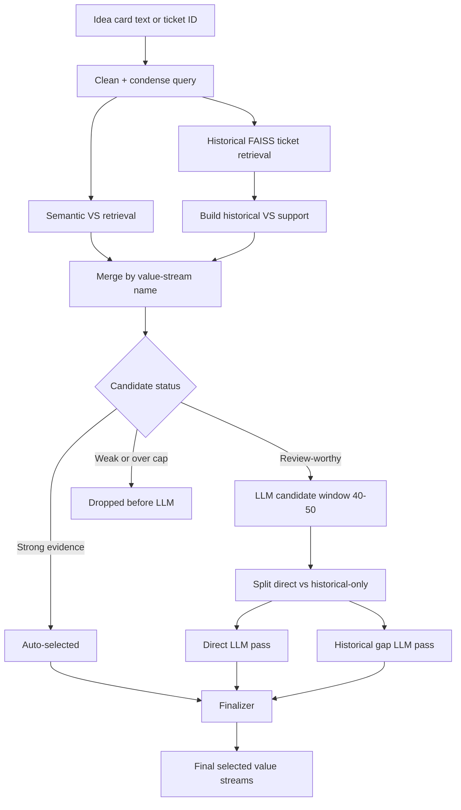
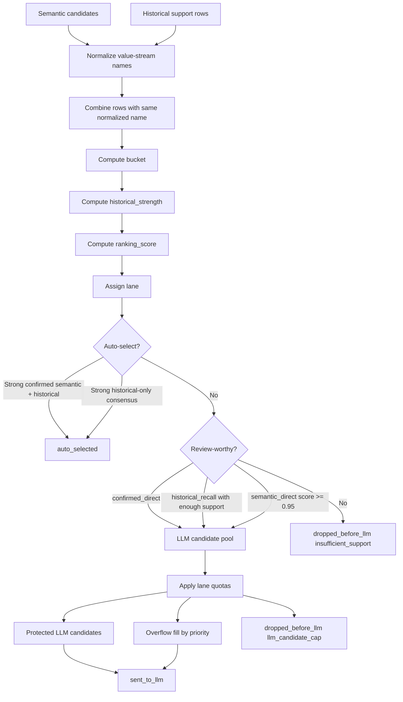
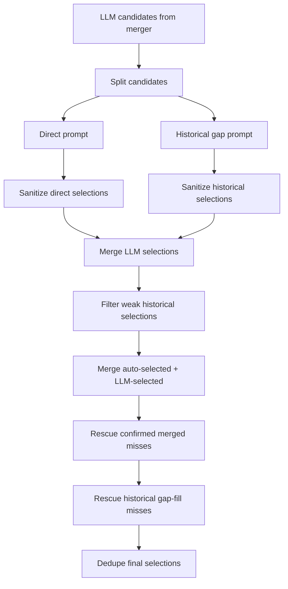

# RAG LLM Window and Latency

This note explains what the `40-50` candidate window means in the value-stream RAG pipeline, why it improved recall, and why it can make the final LLM step feel slower.

## Short Version

`50` does **not** mean the app retrieves only 50 tickets, selects 50 value streams, or calls FAISS 50 times.

It means:

```text
At most 50 merged value-stream candidates can be sent into the final LLM review step.
```

Those candidates are already deduplicated value-stream rows, not raw FAISS chunks. The LLM still chooses a smaller final set from them.

Before the recall fix, the pipeline often sent only about `30-36` merged candidates to the LLM. That was faster, but it caused good candidates to be cut before the LLM could see them. The screenshots showed this exact problem: several ground-truth streams were visible in the `Merged` tab, but marked `DROPPED BEFORE LLM` with reason `CUT BY LLM CAP`.

After the fix, the LLM gets a wider review window, so recall improves. The tradeoff is a larger prompt and more candidates to reason over, so the final LLM step can take longer.

## Where The Number Comes From

The streaming UI path is in:

```text
src/vs_app/api/routes/rag.py
```

The non-streaming/batch path is in:

```text
src/vs_app/modules/rag/pipeline.py
```

Both now use the same cap shape:

```python
top_k_vs = min(max(12, top_k), 50)
max_llm_candidates = min(max(top_k_vs + 15, 40), 50)
```

Read that as:

1. Start with the UI/request candidate count.
2. Never retrieve fewer than 12 semantic value-stream candidates.
3. Never retrieve more than 50 semantic value-stream candidates.
4. Send a wider merged candidate window to the LLM:
   - at least 40,
   - usually `top_k_vs + 15`,
   - never more than 50.

## Examples

| UI candidate slider | `top_k_vs` | `max_llm_candidates` | Meaning                                                                        |
| ------------------: | ---------: | -------------------: | ------------------------------------------------------------------------------ |
|                  12 |         12 |                   40 | Retrieve 12 semantic VS candidates, allow up to 40 merged rows into LLM review |
|                  20 |         20 |                   40 | Retrieve 20 semantic VS candidates, allow up to 40 merged rows                 |
|                  30 |         30 |                   45 | Retrieve 30 semantic VS candidates, allow up to 45 merged rows                 |
|                  40 |         40 |                   50 | Retrieve 40 semantic VS candidates, allow up to 50 merged rows                 |
|                  50 |         50 |                   50 | Retrieve 50 semantic VS candidates, allow up to 50 merged rows                 |

The cap is now aligned to the fixed value-stream taxonomy: there are only about 50 possible value streams, so the upper bound is 50. With the slider at `30`, the current window is usually `45`.

## Full Flow

The pipeline has six main stages.



The same flow as plain text:

```text
idea card
  |
  +--> clean / condense
          |
          +--> semantic VS search ----------------------+
          |                                             |
          +--> historical FAISS ticket search            |
                    |                                    |
                    +--> convert ticket labels to VS support
                                                         |
                                                         v
                                              merge candidates by VS name
                                                         |
                         +-------------------------------+------------------------------+
                         |                               |                              |
                  auto-selected                   sent to final LLM             dropped before LLM
                                                         |
                                      +------------------+------------------+
                                      |                                     |
                              direct LLM pass                      historical gap pass
                                      |                                     |
                                      +------------------+------------------+
                                                         |
                                                     finalizer
                                                         |
                                                final selected VS list
```

### 1. Extract

The backend gets idea-card text from either:

- uploaded/extracted text from the UI, or
- the selected `ticket_id`.

The selected ticket ID also matters for the source-ticket exclusion toggle.

### 2. Prepare Query

The text is cleaned and condensed:

- `cleaned_query`: used for semantic value-stream retrieval.
- `query_for_prompt`: used for historical FAISS search and LLM prompts.

Semantic retrieval and condensation run in parallel in the streaming route.

### 3. Semantic Value-Stream Retrieval

The semantic retriever searches the value-stream index and returns direct value-stream candidates.

These rows usually contain:

- `entity_id`
- `entity_name`
- `description`
- `semantic_score`

This is direct evidence from the current idea card.

### 4. Historical FAISS Retrieval

Historical FAISS searches prior idea-card summaries.

It returns similar tickets, then converts their known labels into value-stream support rows. A historical support row can include:

- `entity_name`
- `support_count`
- `direct_count`
- `implied_count`
- `weighted_support_count`
- `best_support_score`
- `avg_support_score`
- `supporting_ticket_ids`
- `historical_reasons`

This is indirect evidence from similar prior tickets.

If `Exclude source ticket` is enabled, the current ticket ID is removed from historical FAISS hits before support is built. That is the leave-one-out testing mode.

### 5. Merge

`candidate_merger.merge_candidate_sources()` combines semantic candidates and historical support by normalized value-stream name.

The merge stage is the most important part to understand because this is where candidates can be upgraded, protected, auto-selected, or dropped before the LLM.

Each merged row gets a lane:

| Lane                | Meaning                                                            |
| ------------------- | ------------------------------------------------------------------ |
| `confirmed_direct`  | Found by semantic retrieval and also supported by historical FAISS |
| `historical_recall` | Found only through historical support                              |
| `semantic_direct`   | Found only by semantic value-stream retrieval                      |

Then each row gets a ranking score and a candidate status.

Important statuses:

| Status               | Meaning                            |
| -------------------- | ---------------------------------- |
| `auto_selected`      | Strong enough to select before LLM |
| `sent_to_llm`        | Included in final LLM review       |
| `dropped_before_llm` | Not included in final LLM review   |

Important drop reasons:

| Reason                 | Meaning                                                             |
| ---------------------- | ------------------------------------------------------------------- |
| `insufficient_support` | Evidence was too weak                                               |
| `llm_candidate_cap`    | Evidence was good enough for review, but the review window was full |

The screenshot problem was mostly `llm_candidate_cap`, not `insufficient_support`.

The merge stage has this internal shape:



## Merge Details

The merge code lives in:

```text
src/vs_app/modules/rag/augmentation/candidate_merger.py
```

### Step 1: Normalize Names

Semantic and historical rows are joined by normalized `entity_name`.

Roughly:

```text
" Resolve   Request-Inquiry " -> "resolve request-inquiry"
```

If semantic retrieval returns `Resolve Request-Inquiry` and historical support also returns `Resolve Request-Inquiry`, they become one merged row.

### Step 2: Create Initial Rows

For semantic-only rows, merge initializes:

```text
from_semantic = true
from_historical = false
semantic_score = retrieval score
support_count = 0
historical_strength = later computed
```

For historical rows, merge either creates a new row or updates an existing semantic row:

```text
from_historical = true
support_count = number of supporting VS mentions
direct_count = directly tagged historical labels
implied_count = inferred/fallback historical labels
best_support_score = strongest historical ticket/chunk match
avg_support_score = average historical match quality
supporting_ticket_ids = prior tickets behind the support
historical_reasons = short precedent snippets
```

### Step 3: Assign Bucket

Bucket is a simple source label:

| Bucket                     | Condition                              |
| -------------------------- | -------------------------------------- |
| `semantic_plus_historical` | `from_semantic` and `from_historical`  |
| `semantic_only`            | only semantic retrieval found it       |
| `historical_only`          | only historical FAISS support found it |

Bucket helps debug where the candidate came from.

### Step 4: Compute Historical Strength

Historical strength is not just the FAISS score. It combines peak similarity, direct/implied support, and label-source quality:

```python
historical_strength =
    best_support_score
    + 0.18 * weighted_direct_count
    + 0.06 * weighted_implied_count
    + label_source_adjustment
```

`jira_issuelinks` gets a positive adjustment because it is more explicit. `jira_themes_fallback` gets a small penalty when it is the only source because it is fuzzier.

### Step 5: Compute Ranking Score

Ranking score depends on source type:

```python
if semantic and historical:
    ranking_score = semantic_score + 0.25 * historical_strength
elif semantic only:
    ranking_score = semantic_score
else:
    ranking_score = 0.70 * historical_strength
```

This means a `confirmed_direct` row can outrank a pure semantic row because it has both direct semantic fit and historical precedent.

### Step 6: Assign Lane

Lane determines how the candidate is protected before the LLM:

```python
if semantic and historical:
    lane = "confirmed_direct"
elif historical:
    lane = "historical_recall"
elif semantic:
    lane = "semantic_direct"
else:
    lane = "weak_noise"
```

This is why the `Merged` tab is more important than just looking at `FAISS Hits`. `FAISS Hits` tells you which tickets were found; `Merged` tells you whether those ticket labels became reviewable value-stream candidates.

### Step 7: Auto-Select Strong Evidence

Some candidates are selected before the LLM.

Strong confirmed rows are auto-selected when:

```text
semantic_score >= 1.5
best_support_score >= 0.70
support_count >= 4
```

Historical-only rows can also auto-select, but only for very strong consensus. That path is stricter because historical-only candidates can be noisy.

Auto-selected rows skip the LLM for speed and stability. They still go through final dedupe.

### Step 8: Build The LLM Candidate Pool

Rows that are not auto-selected may still be sent to the LLM.

Confirmed rows:

```text
confirmed_direct -> always eligible for LLM review
```

Historical-only rows:

```text
historical_recall -> eligible only if repeated/coherent support gates pass
```

Semantic-only rows:

```text
semantic_direct -> eligible if semantic_score >= 0.95
```

Rows that do not pass these gates become:

```text
dropped_before_llm / insufficient_support
```

### Step 9: Apply Lane Quotas

The LLM cannot review an infinite list. The current cap is usually `40-50`.

Within that cap, lanes get protected slices:

```python
confirmed = min(max(1, ceil(total * 0.55)), 32)
historical = min(max(1, ceil(total * 0.30)), 18)
semantic = remaining space
```

For `max_llm_candidates = 50`:

```text
confirmed_direct: about 28 slots
historical_recall: about 15 slots
semantic_direct: about 7 slots
```

Then the merger:

1. Sorts each lane by lane-specific priority.
2. Takes the protected quota from each lane.
3. Fills leftover room from overflow, favoring confirmed, then historical, then semantic.
4. Marks selected rows as `sent_to_llm`.
5. Marks eligible-but-unselected rows as `dropped_before_llm / llm_candidate_cap`.

That last state means: "this candidate was good enough to review, but the LLM window was full."

## Why The Old Behavior Missed Streams

Before the fix, the cap was effectively:

```python
max_llm_candidates = min(max(top_k_vs, 18), 36)
```

With a UI slider around `30`, only about 30 merged candidates reached the LLM.

Also, the confirmed lane quota was smaller. So if a ticket had many plausible streams, some strong `confirmed_direct` rows were ranked around #11, #12, #20, or #21 in the merged list and still got cut before the LLM.

That is what happened in the screenshots:

- `Recover Overpayment`
- `Discover Business Insights`
- `Issue Payment`
- `Ensure Payment Integrity`
- `Resolve Request-Inquiry`

These were not missing from retrieval. They were found, merged, then dropped before final selection.

## What Changed

### Wider LLM Candidate Window

Now:

```python
max_llm_candidates = min(max(top_k_vs + 15, 40), 50)
```

This keeps more merged candidates alive long enough for the LLM to judge them.

### Stronger Confirmed Lane Protection

The merge stage now protects more `confirmed_direct` rows.

Current quota shape:

```python
confirmed = min(max(1, ceil(total * 0.55)), 32)
historical = min(max(1, ceil(total * 0.30)), 18)
semantic = whatever space remains
```

For a 45-row LLM window, that roughly means:

| Lane                | Approx slots |
| ------------------- | -----------: |
| `confirmed_direct`  |           28 |
| `historical_recall` |           15 |
| `semantic_direct`   |            7 |

That is why the previously missed `MERGED` rows are now more likely to reach the LLM.

### Direct LLM Max Select Scales Up

The direct LLM pass used to be capped at selecting 12 streams.

That is a problem for tickets whose ground truth has more than 12 labels. Even if retrieval and merge found 19 correct labels, the prompt itself was telling the model to pick no more than 12.

Now direct selection uses:

```python
max_select = min(22, max(12, ceil(candidate_count * 0.65)))
```

The implementation now uses the direct candidate count only. We intentionally avoid an evidence-aware ceiling here because the eval set showed recall dropping when plausible direct candidates were hidden behind another post-retrieval gate.

Examples:

| Direct candidates | Max selectable |
| ----------------: | -------------: |
|                 8 |             12 |
|                20 |             13 |
|                30 |             20 |
|                50 |             22 |

The historical gap pass still uses a smaller max because historical-only candidates are noisier.

## Example Run

This example is simplified, but it mirrors the issue shown in the screenshots.

Assume:

```text
Ticket: IDMT-11455
UI historical candidates slider: 30
Exclude source ticket: enabled
top_k_vs = 30
max_llm_candidates = min(max(30 + 15, 40), 50) = 45
```

### Input

The idea card talks about a large operational/payment/member workflow. Ground truth has many labels, for example:

```text
Establish Product Offering
Configure, Price, and Quote
Manage Leads and Opportunities
Order to Cash for Group Coverage
Onboard Partner
Perform Engagement
Resolve Request-Inquiry
Manage Invoice and Payment Receipt
Issue Payment
Ensure Payment Integrity
Recover Overpayment
Discover Business Insights
...
```

### Semantic Retrieval Output

Semantic retrieval might return direct matches like:

| Semantic rank | Value stream                   | Semantic score |
| ------------: | ------------------------------ | -------------: |
|             1 | Establish Product Offering     |           1.72 |
|             2 | Configure, Price, and Quote    |           1.68 |
|             3 | Manage Leads and Opportunities |           1.63 |
|             4 | Onboard Partner                |           1.58 |
|             5 | Perform Engagement             |           1.53 |
|             6 | Discover Business Insights     |           1.44 |
|             7 | Issue Payment                  |           1.41 |
|             8 | Recover Overpayment            |           1.38 |

These are direct current-card signals.

### Historical FAISS Output

Historical FAISS finds similar prior tickets and aggregates their labels:

| Historical support         | Support count | Best score | Example reason                                                   |
| -------------------------- | ------------: | ---------: | ---------------------------------------------------------------- |
| Discover Business Insights |            12 |       0.69 | prior tickets had reporting/insight labels                       |
| Issue Payment              |             8 |       0.69 | prior payment workflow tickets included issuing payments         |
| Recover Overpayment        |             2 |       0.69 | similar claims/payment cleanup tickets included recovery         |
| Ensure Payment Integrity   |             2 |       0.69 | similar payment correctness tickets included integrity           |
| Resolve Request-Inquiry    |            21 |       0.70 | many similar support/request tickets included inquiry resolution |

These are historical precedent signals.

### Merge Output

Now semantic and historical evidence combine:

| Value stream               | From semantic | From historical | Lane                                      | Why                                         |
| -------------------------- | ------------- | --------------- | ----------------------------------------- | ------------------------------------------- |
| Establish Product Offering | yes           | yes             | `confirmed_direct`                        | semantic hit and historical labels agree    |
| Discover Business Insights | yes           | yes             | `confirmed_direct`                        | semantic hit plus 12 historical hits        |
| Issue Payment              | yes           | yes             | `confirmed_direct`                        | semantic hit plus 8 historical hits         |
| Recover Overpayment        | yes           | yes             | `confirmed_direct`                        | semantic hit plus historical support        |
| Resolve Request-Inquiry    | maybe         | yes             | `confirmed_direct` or `historical_recall` | depends whether semantic retrieval found it |
| Optimize Reserves          | yes           | no              | `semantic_direct`                         | semantic-only candidate                     |
| Reconcile Data             | no            | yes             | `historical_recall`                       | historical-only candidate                   |

Before the fix, some of these would appear in `Merged` around ranks like #11, #12, #20, or #21 and be cut:

```text
MERGED / DROPPED BEFORE LLM / CUT BY LLM CAP
```

After the fix, a 45-row window plus stronger confirmed-lane quota should keep them as:

```text
MERGED / SENT TO LLM / PROTECTED CONFIRMED LANE
```

### LLM Candidate Window

For this run:

```text
max_llm_candidates = 45
```

The merger does not blindly take the top 45 rows by global ranking. It protects lanes first.

Approximate shape:

| Lane                | Protected slots | Example candidates                                             |
| ------------------- | --------------: | -------------------------------------------------------------- |
| `confirmed_direct`  |              25 | Discover Business Insights, Issue Payment, Recover Overpayment |
| `historical_recall` |              14 | historical-only gap candidates                                 |
| `semantic_direct`   |               6 | semantic-only candidates                                       |

This is the recall fix. The `confirmed_direct` lane now has enough room for true labels that are lower in the merged ranking but still strongly supported.

### Split For Final LLM

The finalizer splits candidates into two LLM prompts:

```text
direct pass:
  confirmed_direct + semantic_direct

historical gap pass:
  historical_recall / historical-only
```

So a run might look like:

```text
45 llm candidates
  |
  +-- about 31 direct candidates
  +-- about 14 historical gap candidates
```

The two LLM calls run in parallel when both groups exist.

### Direct LLM Pass

The direct prompt contains candidates that have direct semantic evidence or semantic+historical confirmation.

Its max selectable value now scales:

```python
max_select = min(22, max(12, ceil(candidate_count * 0.65)))
```

If the direct pass has 35 candidates:

```text
ceil(35 * 0.65) = 23
max_select = 23
```

Before, this was fixed at 12. That meant a 19-label ticket could not get full recall from the prompt even if all 19 labels were in front of the model.

### Historical Gap LLM Pass

The historical gap prompt is more conservative:

```text
min_select = 0
max_select = 12
```

It is allowed to choose nothing. This matters because historical-only candidates often include adjacent processes that are plausible but not truly in the current idea card.

### Finalizer Result

The finalizer combines:

```text
auto-selected rows
+ direct LLM selections
+ historical gap LLM selections that pass evidence filters
+ rescued confirmed-merged misses
+ rescued historical gap-fill misses
```

Then it dedupes by value-stream name.

A simplified final output might be:

| Candidate                   | How it got selected                |
| --------------------------- | ---------------------------------- |
| Establish Product Offering  | direct LLM                         |
| Configure, Price, and Quote | direct LLM                         |
| Discover Business Insights  | direct LLM or confirmed rescue     |
| Issue Payment               | direct LLM or confirmed rescue     |
| Recover Overpayment         | confirmed rescue if LLM skipped it |
| Resolve Request-Inquiry     | historical gap LLM or rescue       |

If something is still missed, check its last known state:

| Last known state                            | Meaning                                              |
| ------------------------------------------- | ---------------------------------------------------- |
| absent from `FAISS Hits`                    | retrieval did not find supporting tickets            |
| absent from `Merged`                        | no semantic/historical support became a VS candidate |
| `DROPPED BEFORE LLM / INSUFFICIENT SUPPORT` | evidence gate rejected it before LLM                 |
| `DROPPED BEFORE LLM / CUT BY LLM CAP`       | candidate window too small                           |
| `SENT TO LLM` but not selected              | LLM/finalizer rejected it                            |

## Finalizer Details

The finalizer code lives in:

```text
src/vs_app/modules/rag/augmentation/finalizer.py
```

Its job is not just "call the LLM." It does five things:



### Step 1: Split Candidates

`_split_llm_candidates()` separates candidates:

```python
if candidate_lane == "historical_recall" or historical-only:
    historical_gap_candidates.append(row)
else:
    direct_candidates.append(row)
```

This prevents historical-only gap candidates from crowding the direct prompt.

### Step 2: Run LLM Passes

If both candidate groups exist, the finalizer runs them in parallel with `ThreadPoolExecutor(max_workers=2)`.

Direct pass:

```text
Prompt: build_direct_candidate_prompt()
System: min_select=4, max_select=_direct_selection_max(len(candidates))
```

Historical gap pass:

```text
Prompt: build_historical_gap_prompt()
System: min_select=0, max_select=12
```

This is why latency can still increase even though the two calls are parallel: each call may have a larger prompt, and the direct pass may be allowed to produce a longer answer.

### Step 3: Sanitize LLM Output

The LLM is not allowed to invent streams.

`sanitize_selected()` checks the model output against the candidate list. If the model emits something outside the candidate set, it is removed.

This is an important safety rail: widening the LLM window gives the model more real candidates, but it still cannot pick arbitrary labels.

### Step 4: Filter Weak Historical-Only Selections

Historical-only selections get evidence checked again.

If a historical-only candidate is selected by the LLM but fails `_passes_gap_fill_evidence()` and does not have high LLM confidence, it is dropped as:

```text
weak_historical_gap_fill_evidence
```

This is why some historical-only false positives do not make final output even if the model picked them.

Direct LLM selections are trusted after sanitizer validation. That means `confirmed_direct` and `semantic_direct` rows selected by the LLM are kept even when their scores are borderline. This is the recall-first setting: the ground-truth labels can be incomplete, so the pipeline should not discard a plausible direct business selection just because one numeric gate is low.

### Step 5: Merge Selected Rows

`_merge_selected()` combines:

```text
auto_selected + filtered LLM-selected
```

If the same stream appears twice, it keeps the higher confidence and merges reasons/support IDs.

### Step 6: Rescue Confirmed-Merged Misses

This is a backstop for rows that were:

```text
from_semantic = true
from_historical = true
candidate_lane = confirmed_direct
```

If the LLM skipped one but evidence is strong enough, `_rescue_confirmed_merged()` can add it back.

Current budget:

```text
_CONFIRMED_MERGED_RESCUE_BUDGET = 12
```

Evidence gate:

```text
weighted_support >= 0.75
and one of:
  support_count >= 5 and semantic_score >= 1.20 and best_score >= 0.60
  support_count >= 5 and semantic_score >= 1.00
  support_count >= 3 and semantic_score >= 1.35 and best_score >= 0.65
```

This rescue exists because `confirmed_direct` rows are the most trustworthy: two independent paths found the same value stream.

### Step 7: Rescue Historical Gap-Fill Misses

Historical-only rescue is stricter and smaller.

Current budget:

```text
_HISTORICAL_GAP_FILL_BUDGET = 4
```

It only considers:

```text
candidate_lane = historical_recall
from_historical = true
from_semantic = false
```

It then applies `_passes_gap_fill_evidence()`, which checks support count, direct/implied counts, best score, average score, weighted support, and number of supporting tickets.

This conservative budget is intentional. Historical-only candidates can recover misses, but they are also the easiest place to introduce false positives.

### Step 8: Produce Final Selected Streams

Final output is:

```text
auto-selected
+ filtered direct LLM selections
+ filtered historical gap LLM selections
+ confirmed-merged rescues
+ historical gap-fill rescues
deduped by value-stream name
```

That final list is what the UI compares against ground truth.

## Why It Got Slower

The final LLM step now sees more information.

Before:

```text
About 30-36 merged candidates
Direct LLM max selectable: 12
```

After:

```text
About 40-50 merged candidates
Direct LLM max selectable: up to 22
```

That affects latency in three ways:

1. The prompt is longer because it contains more candidate names, descriptions, scores, and historical support.
2. The model has more options to compare.
3. The output can be longer because it is allowed to select more final streams.

Retrieval and merge are usually not the main slowdown here. The slow part is mostly the final LLM selection.

## Why We Did Not Just Auto-Select Everything

The tempting fix is: if historical and semantic both found it, just select it.

That improves recall but can hurt precision. Some screenshots also showed plausible false positives such as adjacent operational streams that are related but not actually ground truth.

So the current design is:

1. Auto-select only very strong evidence.
2. Send more borderline-but-plausible candidates to the LLM.
3. Let finalizer rescue confirmed misses when evidence is strong enough.
4. Keep historical-only rescue stricter.

That is why the recall improved without completely opening the floodgates.

## How To Tune Speed vs Recall

There are three practical knobs.

### Option A: Lower The Global LLM Window

Example:

```python
max_llm_candidates = min(max(top_k_vs + 15, 36), 50)
```

This would make UI runs faster, but it could reintroduce misses for large-label tickets.

### Option B: Dynamic High-Recall Mode

Use a normal cap for most tickets and widen only when many candidates are cross-confirmed.

Example behavior:

```text
Normal ticket: cap 42
Many confirmed candidates: cap 45-50
Batch/eval mode: cap 50
```

This is probably the best long-term behavior.

### Option C: UI Toggle

Add a UI toggle:

```text
High recall mode
```

Off:

```text
Faster, smaller LLM window
```

On:

```text
Slower, wider LLM window, better recall diagnostics
```

This makes the tradeoff explicit during testing.

## How To Read The UI Tabs

If a stream is missing from final output:

1. Check `FAISS Hits`.
   - If it is absent there, historical retrieval did not surface it.
2. Check `Merged`.
   - If it is absent there, semantic and historical support did not produce a merged candidate.
3. If present in `Merged`, inspect the pill:
   - `SENT TO LLM`: the LLM saw it.
   - `DROPPED BEFORE LLM / CUT BY LLM CAP`: the cap blocked it.
   - `DROPPED BEFORE LLM / INSUFFICIENT SUPPORT`: evidence gate blocked it.
4. Check final comparison.
   - If it was `SENT TO LLM` but missed, the final LLM or rescue logic rejected it.

The latest issue was mostly case 3: `CUT BY LLM CAP`.

## Current Recommendation

The current settings are intentionally recall-friendly because we are testing the historical RAG behavior.

For normal interactive use, the next improvement should be a dynamic cap:

```text
Keep the wide retrieval and merge.
Use a smaller LLM window unless many strong confirmed candidates exist.
```

That should keep most of the recall gain while reducing final LLM latency.
