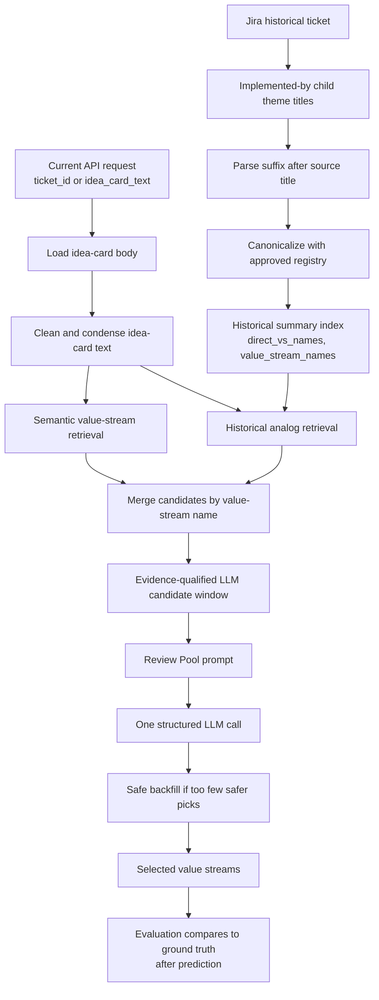

# Value-Stream RAG Architecture

This document describes the current value-stream prediction flow and the boundary
between prediction input, historical labels, and evaluation ground truth.

## Core Rule

Current prediction must not extract value-stream labels from the current idea-card
text.

Prediction uses:

```text
idea-card text
semantic value-stream retrieval
historical analog retrieval
candidate merge
Review Pool LLM selection
```

Historical labels from implemented-by child themes are used for historical indexing
and evaluation after prediction. They are not passed into the same ticket's
prediction run.

## End-To-End Flow



## Historical Labels

Historical ingestion may parse implemented-by child theme titles such as:

```text
Source title:
CP 2025 Health Management & Advocacy: Digital GTM

Child theme title:
CP 2025 Health Management & Advocacy: Digital GTM - Establish Product Offering
```

The parser extracts the value-stream suffix:

```json
{
  "raw_value_stream_suffix": "Establish Product Offering",
  "canonical_name": "Establish Product Offering",
  "entity_id": "VSR...",
  "match_type": "exact"
}
```

Those labels are stored in historical documents:

```json
{
  "direct_vs_names": ["Establish Product Offering"],
  "value_stream_names": ["Establish Product Offering"]
}
```

They support historical analog retrieval and batch evaluation. They are not request
metadata for current prediction.

## Prediction Flow

```text
idea-card text
   ↓
clean / condense text
   ↓
semantic VS retrieval
   ↓
historical ticket retrieval
   ↓
merge candidates
   ↓
one Review Pool LLM call
   ↓
selected value streams
```

The candidate prompt contains only candidate identity, lane, description, semantic
score, and historical evidence. It does not contain externally supplied label hints.

## Source Ownership

| Concern | Owner |
| --- | --- |
| Raw idea-card body extraction | `integrations/files/idea_card_extractor.py` |
| Historical child-theme suffix parsing | `ingestion/jira/value_stream_labels/theme_title_parser.py` |
| Canonical value-stream mapping | `modules/value_streams/canonical.py` |
| Retrieval, merge, finalizer orchestration | `modules/rag/pipeline.py` |
| Runtime thresholds | `modules/rag/config/runtime.py` |
| Candidate window lanes | `modules/rag/augmentation/candidate_merger.py` |
| Review Pool prompt formatting | `modules/rag/augmentation/prompt_context.py` |
| Final Review Pool LLM selection | `modules/rag/augmentation/finalizer.py` |

## Runtime Thresholds

Runtime settings are derived from `final_output_count`.

| Setting | Current Value / Rule |
| --- | --- |
| Requested output count | `max(1, final_output_count or 12)` |
| Semantic retrieval fetch | `60` when `final_output_count` is provided |
| Historical ticket fetch | `60` when `final_output_count` is provided |
| Semantic fetch hard clamp | `1..50` in pipeline |
| Historical fetch hard clamp | `1..40` in pipeline |
| LLM candidate window | `min(50, max(35, ceil(requested * 3.0)))` |
| Max merged lane candidates | Full LLM window |
| Max historical-only candidates | `min(8, max(4, floor(window * 0.16)))` |
| Max semantic-only candidates | `min(5, max(1, window - merged_cap - historical_cap))` |
| Supporting tickets per candidate | `2` |
| Idea-card prompt chars | `1800` |
| Candidate description chars | `100` |
| Analogs per candidate | `2` |
| Analog chars | `80` |
| Historical ticket IDs per candidate | `2` |

Retrieval stays broad to preserve recall. Precision is controlled by candidate
window gates, prompt evidence, and bounded final output count.

## Candidate Lanes

| Lane | Meaning | Selection Behavior |
| --- | --- | --- |
| `semantic_plus_historical` | Found semantically and supported by historical analogs | Highest priority; can fill the whole LLM window |
| `historical_only` | Supported by similar prior tickets but not semantic retrieval | Must pass historical quality gates and is cap-limited |
| `semantic_only` | Found semantically but without historical support | Must pass high semantic score gates and is tightly cap-limited |

Historical-only candidates enter the LLM window only if any condition is true:

```text
supporting_ticket_count >= 2
direct_count >= 1
best_support_score >= 0.65
weighted_support >= 0.6
```

Semantic-only candidates enter only if:

```text
semantic_score >= 1.20
```

Generic/risky semantic-only streams need:

```text
semantic_score >= 1.35
```

## Review Pool LLM Selection

The finalizer makes one structured LLM call:

```text
input: evidence-qualified candidate window
output: selected value streams, max final_output_count
```

If the LLM returns too few picks, safe backfill may add low-confidence candidates
only from `semantic_plus_historical` when:

```text
semantic_score >= 1.05 OR supporting_ticket_count >= 3
```

Safe backfill is capped by:

```text
min_target = min(requested_output_count, 8)
```

Rows show their source:

```json
{
  "selection_source": "llm_pick"
}
```

or:

```json
{
  "selection_source": "safe_backfill"
}
```

## Evaluation

Evaluation is post-prediction:

```text
selected value streams
   ↓
compare to ground truth from historical labels
```

Batch eval does not pass current-ticket ground truth or idea-card-extracted labels
into `select_value_streams(...)`.

## Debug Output

Prediction responses include:

```json
{
  "candidate_window_counts": {
    "semantic_plus_historical": 12,
    "semantic_only": 1,
    "historical_only": 5
  },
  "rag_runtime_config": {
    "final_output_count": 7,
    "semantic_fetch_k": 60,
    "historical_ticket_fetch_k": 60,
    "llm_candidate_window": 35
  }
}
```

`debug.fingerprints` tracks stable hashes of the query, retrieval sets, LLM
candidate window, LLM picks, and final selections.

## Correct Boundary

```text
Historical ingestion:
  implemented-by child themes -> canonical value-stream labels -> historical index

Current prediction:
  idea-card text -> retrieval -> merge -> Review Pool LLM -> selected streams

Evaluation:
  selected streams -> compare against ground truth labels

Theme creation:
  selected stream -> "{IDMT title} - {Canonical Value Stream Name}"
```
