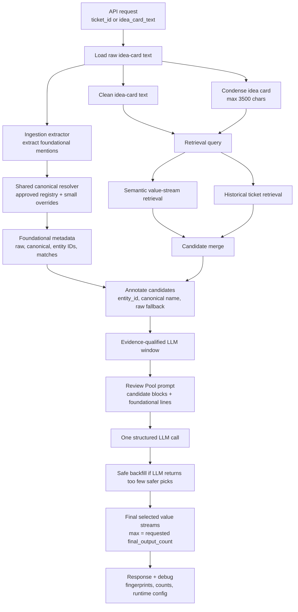

# Value-Stream RAG Architecture

This document explains the current value-stream recommendation flow, including the
foundational-signal metadata, retrieval/window thresholds, and final Review Pool LLM
selection behavior.

## What Foundational Signal Means

A **foundational signal** is a value stream that the idea card itself names as a
current-card anchor, example, capability, or foundational/operational value stream.

Example idea-card text:

```text
Foundational Value Streams: Order to Cash, Establish Product Offering
```

Ingestion extracts those raw mentions and canonicalizes them:

```json
{
  "raw": "Order to Cash",
  "canonical_name": "Order to Cash for Group Coverage",
  "entity_id": "...",
  "match_type": "alias"
}
```

RAG then annotates matching candidates:

```json
{
  "entity_name": "Order to Cash for Group Coverage",
  "foundational_signal": true,
  "foundational_match_text": "Order to Cash",
  "foundational_match_type": "alias"
}
```

Important: foundational signal is **not auto-selection**. It is strong current-card
evidence shown to the Review Pool LLM so it does not skip direct anchors in favor
of adjacent streams.

## End-To-End Flow



## Source Ownership

| Concern | Owner |
| --- | --- |
| Raw idea-card text extraction | `integrations/files/idea_card_extractor.py` |
| Raw foundational mention extraction | `integrations/files/idea_card_extractor.py` |
| Canonical value-stream mapping | `modules/value_streams/canonical.py` |
| Candidate annotation only | `modules/rag/augmentation/foundational_signals.py` |
| Retrieval, merge, finalizer orchestration | `modules/rag/pipeline.py` |
| Runtime thresholds | `modules/rag/config/runtime.py` |
| Candidate window lanes | `modules/rag/augmentation/candidate_merger.py` |
| Review Pool prompt formatting | `modules/rag/augmentation/prompt_context.py` |
| Final Review Pool LLM selection | `modules/rag/augmentation/finalizer.py` |

RAG intentionally does not own alias dictionaries. It consumes metadata from
ingestion and canonicalizes raw fallback mentions through the shared resolver.

## Runtime Thresholds

Runtime settings are derived from `final_output_count`.

| Setting | Current Value / Rule |
| --- | --- |
| Requested output count | `max(1, final_output_count or 12)` |
| Semantic retrieval fetch | `60` when `final_output_count` is provided |
| Historical ticket fetch | `60` when `final_output_count` is provided |
| Semantic fetch hard clamp | `1..50` in pipeline |
| Historical fetch hard clamp | `1..40` in pipeline |
| LLM candidate window | `min(50, max(35, ceil(requested * 3.0)))` |
| Max merged lane candidates | Full LLM window |
| Max historical-only candidates | `min(8, max(4, floor(window * 0.16)))` |
| Max semantic-only candidates | `min(5, max(1, window - merged_cap - historical_cap))` |
| Supporting tickets per candidate | `2` |
| Idea-card prompt chars | `1800` |
| Candidate description chars | `100` |
| Analogs per candidate | `2` |
| Analog chars | `80` |
| Historical ticket IDs per candidate | `2` |

The output count controls final selection size and prompt/window sizing. Retrieval
stays broad enough to preserve recall.

## Candidate Lanes

Candidates are merged by normalized value-stream name and assigned one lane:

| Lane | Meaning | Selection Behavior |
| --- | --- | --- |
| `semantic_plus_historical` | Found by semantic retrieval and supported by history | Highest priority; can fill the whole LLM window |
| `historical_only` | Supported by similar prior tickets but not semantic retrieval | Must pass historical quality gates and is cap-limited |
| `semantic_only` | Found semantically but without historical support | Must pass high semantic score gates and is tightly cap-limited |

## Candidate Quality Gates

Historical-only candidates enter the LLM window only if any condition is true:

```text
supporting_ticket_count >= 2
direct_count >= 1
best_support_score >= 0.65
weighted_support >= 0.6
```

Semantic-only candidates enter the LLM window only if:

```text
semantic_score >= 1.20
```

Generic/risky semantic-only streams need a higher score:

```text
semantic_score >= 1.35
```

Generic/risky streams are not banned; they are penalized so they do not crowd out
more specific evidence-backed candidates.

## Foundational Annotation Priority

`annotate_foundational_signals(...)` marks candidates in this order:

1. Match candidate `entity_id` against foundational entity IDs.
2. Match candidate canonical `entity_name` against foundational canonical names.
3. Canonicalize raw foundational mentions through the shared resolver.
4. Use text fallback only when no metadata exists.

The prompt then includes lines like:

```text
Foundational signal: alias match to "Order to Cash"
Foundational signal: canonical match to "Order to Cash for Group Coverage"
Foundational signal: domain_signal match to "Ensure Payment Integrity"
```

## Review Pool LLM Selection

The finalizer makes one structured LLM call:

```text
input:  evidence-qualified candidate window
output: selected value streams, max final_output_count
```

The LLM may reject candidates. It should normally include foundational-signal
candidates unless the evidence contradicts the idea card.

If the LLM returns too few picks, safe backfill may add low-confidence candidates
only from `semantic_plus_historical` when they have enough evidence:

```text
semantic_score >= 1.05 OR supporting_ticket_count >= 3
```

Safe backfill is capped by:

```text
min_target = min(requested_output_count, 8)
```

Backfilled rows are marked:

```json
{
  "selection_source": "safe_backfill"
}
```

LLM-selected rows are marked:

```json
{
  "selection_source": "llm_pick"
}
```

## Debug Output

Responses include diagnostic fields for traceability:

```json
{
  "foundational_signals": ["Order to Cash for Group Coverage"],
  "foundational_signal_source": "ingestion_metadata",
  "foundational_value_stream_matches": [
    {
      "raw": "Order to Cash",
      "canonical_name": "Order to Cash for Group Coverage",
      "entity_id": "...",
      "match_type": "alias"
    }
  ],
  "candidate_window_counts": {
    "semantic_plus_historical": 12,
    "semantic_only": 1,
    "historical_only": 5
  },
  "rag_runtime_config": {
    "final_output_count": 7,
    "semantic_fetch_k": 60,
    "historical_ticket_fetch_k": 60,
    "llm_candidate_window": 35
  }
}
```

`debug.fingerprints` also tracks stable hashes of the query, retrieval sets, LLM
candidate window, LLM picks, and final selections. This helps compare runs without
dumping huge payloads.

## Design Intent

The architecture is tuned for:

```text
broad retrieval
evidence-qualified candidate window
metadata-first foundational annotation
one Review Pool LLM call
bounded final output count
```

The main precision guardrail is not narrower retrieval. It is stricter candidate
windowing plus prompt-visible evidence so the LLM chooses current-card anchors
before weak adjacent streams.
