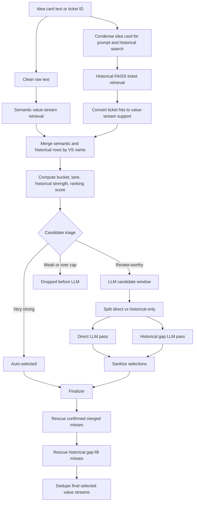
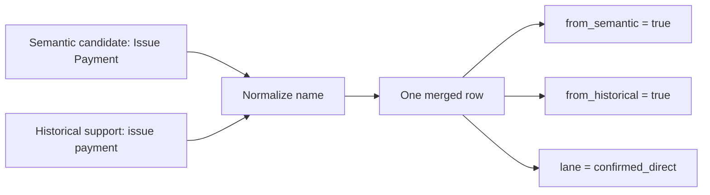
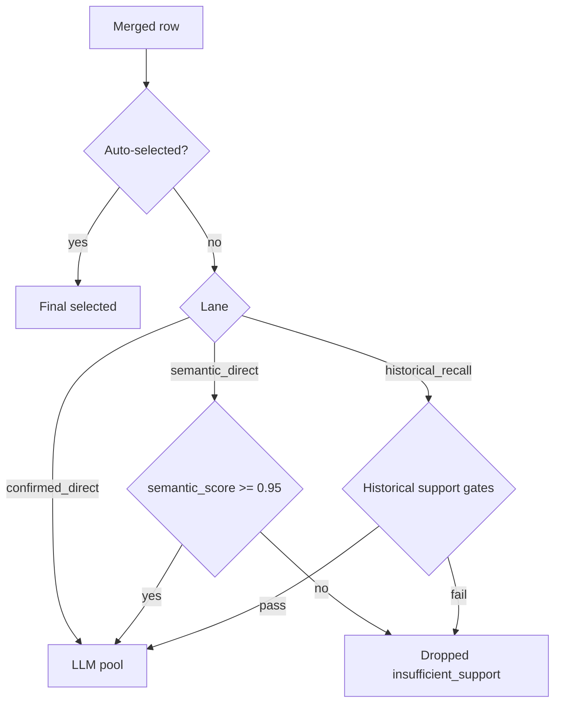
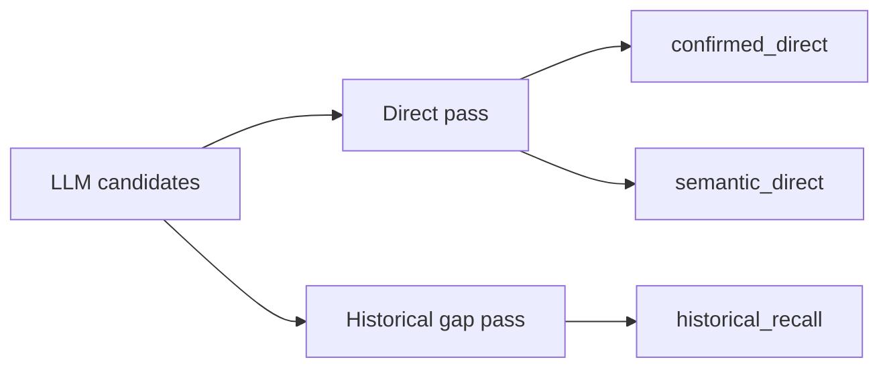
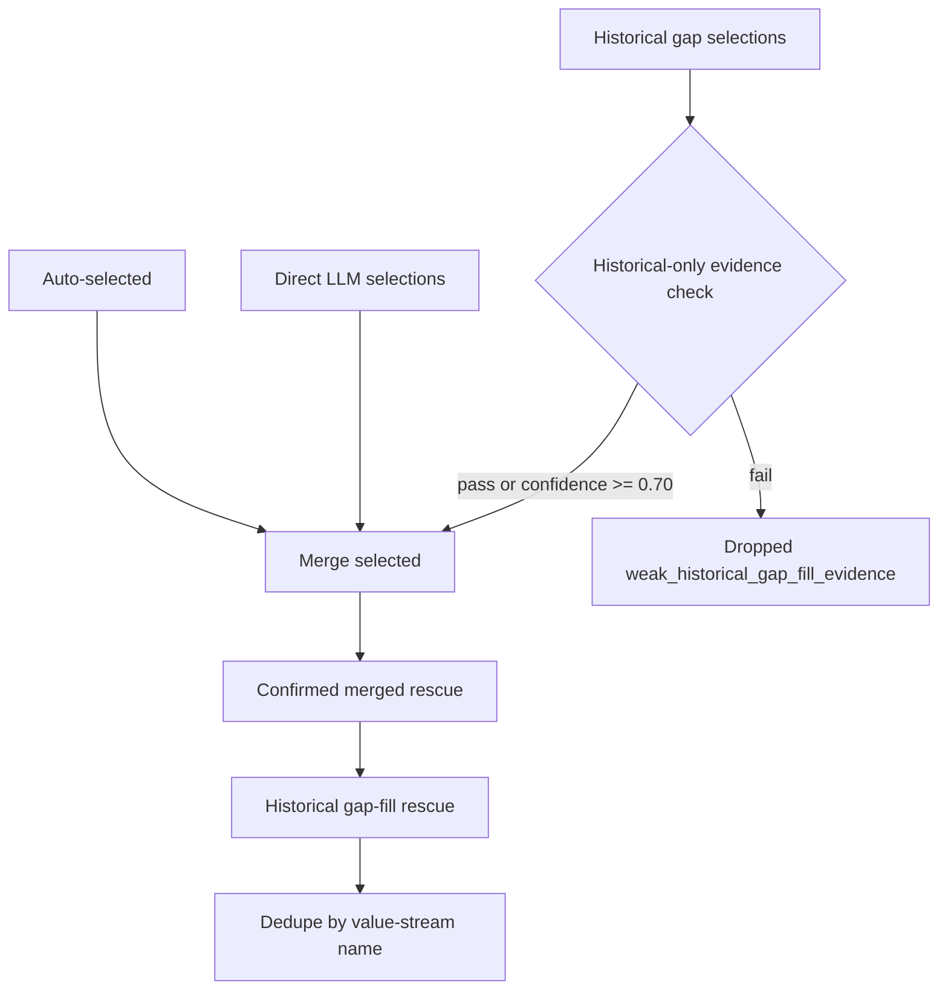

# Value Stream Historical RAG Pipeline

This document explains the full value-stream RAG flow end to end: retrieval, historical FAISS support, merge, LLM selection, finalization, limits, offsets, scoring formulas, and the reason behind the current heuristic math.

The short version: the pipeline does not ask the LLM to classify from scratch. It first builds a bounded candidate set from semantic retrieval and historical ticket retrieval, merges those signals by value-stream name, protects recall-heavy lanes, then asks the LLM to choose from real candidates only.

## Key Files

| Area | File |
| --- | --- |
| Streaming API route | `src/vs_app/api/routes/rag.py` |
| Non-streaming and batch pipeline | `src/vs_app/modules/rag/pipeline.py` |
| Semantic VS retrieval | `src/vs_app/modules/rag/retrieval/semantic_retriever.py` |
| Historical FAISS retrieval | `src/vs_app/modules/rag/retrieval/historical_retriever.py` |
| Candidate merge and ranking | `src/vs_app/modules/rag/augmentation/candidate_merger.py` |
| Prompt context construction | `src/vs_app/modules/rag/augmentation/prompt_context.py` |
| LLM finalizer and rescue | `src/vs_app/modules/rag/augmentation/finalizer.py` |
| LLM output sanitizer | `src/vs_app/modules/rag/ranking/reranker.py` |
| Direct selection prompt | `prompt_yaml/selection.yaml` |
| Historical gap prompt | `prompt_yaml/historical_gap_selection.yaml` |
| Batch eval script | `scripts/evaluate_rag_batch.py` |

## One Picture



## Request Inputs

The UI calls either:

- `POST /rag/value-streams/stream`
- `POST /rag/value-streams`

Important inputs:

| Input | Meaning |
| --- | --- |
| `ticket_id` | Jira/idea-card ID such as `IDMT-19761`. Used for display, source-ticket exclusion, and ground-truth comparison. |
| `idea_card_text` | Uploaded or extracted idea-card text. This becomes the query. |
| `top_k_value_streams` | Semantic VS retrieval size from the UI. |
| `top_k_historical` | Historical RAG candidate slider from the UI. |
| `exclude_source_ticket_from_historical` | Leave-one-out toggle. When on, the current ticket is removed from historical FAISS hits. |
| `use_llm_finalizer` | Whether final selection should use LLM review. |

When uploaded text and a selected ticket ID both exist, the text is the query, but the ticket ID still controls source exclusion and comparison.

## Step 1: Query Preparation

The pipeline prepares two query forms:

| Query | Source | Used For |
| --- | --- | --- |
| `cleaned_query` | `clean_ppt_text(query)` | Semantic VS retrieval |
| `query_for_prompt` | `condense_idea_card(query, max_chars=3500)` | Historical FAISS retrieval and LLM prompts |

The non-streaming path runs condensation and semantic retrieval in parallel:

```python
with ThreadPoolExecutor(max_workers=2):
    condense_idea_card(...)
    retrieve_semantic_candidates(...)
```

Why this exists:

- Semantic retrieval benefits from cleaned but still rich text.
- LLM prompts and historical retrieval work better with a condensed business summary.
- Parallelism hides part of the condensation latency.

## Step 2: Retrieval Limits

The UI sends a requested candidate count. In the code this arrives as `fetch_count`. Before the pipeline calls any retriever, that one number is turned into three separate limits:

```python
top_k = min(max(12, fetch_count), 50)
max_llm_candidates = min(max(top_k + 15, 40), 50)
historical_max_ticket_hits = min(max(12, fetch_count), 40)
```

These three values are used in different places:

| Value | Used By | What It Controls |
| --- | --- | --- |
| `top_k` | `retrieve_semantic_candidates(..., top_k=top_k)` | How many direct semantic value-stream candidates come back from the value-stream index. |
| `historical_max_ticket_hits` | `retrieve_historical_support(..., max_ticket_hits=historical_max_ticket_hits)` | How many similar historical tickets are kept from FAISS before they are converted into value-stream support. |
| `max_llm_candidates` | `merge_candidate_sources(..., max_llm_candidates=max_llm_candidates)` | How many merged value-stream candidates are allowed to reach the final LLM review step. |

The important distinction:

```text
top_k controls semantic value streams.
historical_max_ticket_hits controls historical tickets.
max_llm_candidates controls merged value-stream rows after semantic and historical evidence are combined.
```

So `max_llm_candidates = 45` does not mean 45 tickets are retrieved. It means that after semantic value streams and historical ticket-derived value streams are merged, up to 45 unique value-stream candidates can be sent to the LLM.

### Why Minimum 12

`12` prevents tiny candidate windows from starving the LLM. Many real tickets have more than a handful of plausible value streams, and early experiments showed that low windows caused recall misses before the LLM had a chance.

### Why Maximum 50

There are only about 50 possible predefined value streams in the taxonomy. Asking for more than 50 semantic value-stream rows does not add new labels. It mostly adds duplicate/noisy work.

### Why `top_k + 15`

Semantic retrieval and historical retrieval are merged later. A ticket may ask for 30 value streams from the UI, but after historical candidates are merged in, useful cross-confirmed rows can land below rank 30. The `+15` offset gives the merged list headroom so candidates found by both semantic and historical signals are not cut too early.

### Why Minimum LLM Window 40

For broad tickets, the final candidate list can easily contain:

- 20 to 30 confirmed candidates,
- 10 to 15 historical-only candidates,
- a few semantic-only candidates.

An LLM window below 40 repeatedly caused `DROPPED BEFORE LLM / llm_candidate_cap` misses in the UI.

### Why Historical Ticket Hits Cap 40

Historical FAISS retrieves prior tickets, not value streams. More tickets means more labels, more broad support, and more prompt noise. `40` is enough to find repeated patterns while limiting broad-ticket contamination.

### Limit Examples

| UI fetch count | Semantic `top_k` | Historical hits | LLM candidate cap |
| ---: | ---: | ---: | ---: |
| 5 | 12 | 12 | 40 |
| 12 | 12 | 12 | 40 |
| 20 | 20 | 20 | 40 |
| 30 | 30 | 30 | 45 |
| 40 | 40 | 40 | 50 |
| 50 | 50 | 40 | 50 |
| 75 | 50 | 40 | 50 |

Example with `fetch_count = 30`:

```text
top_k = 30
historical_max_ticket_hits = 30
max_llm_candidates = 45
```

The run does this:

1. Retrieve up to 30 semantic value-stream candidates from the value-stream index.
2. Retrieve up to 30 historical FAISS ticket hits.
3. Convert those historical tickets into value-stream support rows.
4. Merge semantic and historical value-stream rows by name.
5. Allow up to 45 merged value-stream rows into the LLM candidate window.

## Step 3: Semantic Value-Stream Retrieval

Semantic retrieval searches the value-stream index directly from the current idea card.

Typical candidate fields:

```json
{
  "entity_id": "VS-123",
  "entity_name": "Establish Product Offering",
  "description": "The gathering of market attributes...",
  "semantic_score": 1.72
}
```

This is direct evidence. It answers:

```text
Which value streams does the current idea card itself look like?
```

Semantic retrieval does not know historical ticket patterns.

## Step 4: Historical FAISS Retrieval

Historical FAISS searches prior idea-card summaries. It returns similar tickets, not value streams directly.

Each hit carries metadata:

```json
{
  "ticket_id": "IDMT-8199",
  "best_score": 0.696,
  "title": "...",
  "summary_preview": "...",
  "direct_vs_names": ["Resolve Request-Inquiry"],
  "implied_vs_names": ["Manage Member Care"],
  "label_source": "jira_issuelinks"
}
```

This is precedent evidence. It answers:

```text
When prior tickets looked like this one, which value streams were attached?
```

## Source Ticket Exclusion

The UI toggle `Exclude source ticket` removes the current ticket from historical FAISS hits.

This matters for testing. If `IDMT-19761` searches the historical index and the same `IDMT-19761` is allowed, the pipeline can see its own labels. That inflates recall and hides whether the system generalizes.

When exclusions are active:

```python
exclusion_backfill = max(8, len(excluded_ticket_ids) * 3)
fetch_k = max_ticket_hits + exclusion_backfill
```

### Why Backfill Exists

If the self-ticket is removed, the FAISS result list now has a hole. Backfill fetches extra neighbors so the pipeline can still return the requested number of non-excluded historical tickets.

### Why `max(8, len(excluded) * 3)`

For normal UI use, only one ticket is excluded. `len(excluded) * 3` would fetch only 3 extra rows, which can be too small if near-duplicates or bad metadata are also filtered. The minimum `8` is a practical cushion.

For batch or future multi-ticket exclusions, `len(excluded) * 3` scales the cushion with the number of removed IDs.

## Step 5: Convert FAISS Hits To Value-Stream Support

Historical retrieval turns ticket-level hits into value-stream-level support.

For each historical ticket:

1. Prefer `direct_vs_names`.
2. Add `implied_vs_names` that are not already direct.
3. If direct/implied are missing, use `stream_support_type`.
4. If that is missing too, fall back to `value_stream_names` or `value_stream_labels`.

Fallback inference:

| Label Source | Fallback Type |
| --- | --- |
| `jira_issuelinks` | direct |
| anything else | implied |

### Per-Ticket Weight

Each historical ticket gets total weight `1.0`, split across its value streams:

```python
per_ticket_weight = 1.0 / number_of_streams_on_ticket
```

Why:

- A ticket tagged with 2 streams should give each stream meaningful support.
- A ticket tagged with 12 streams should not give every stream the same power as a narrow direct ticket.
- This prevents broad tickets from overpowering the merge simply because they list many labels.

Example:

| Historical Ticket | Streams On Ticket | Weight Per Stream |
| --- | ---: | ---: |
| `IDMT-1` | 2 | 0.500 |
| `IDMT-2` | 5 | 0.200 |
| `IDMT-3` | 10 | 0.100 |

Support fields created per value stream:

| Field | Meaning |
| --- | --- |
| `support_count` | Raw count of support observations. |
| `direct_count` | Count of direct support observations. |
| `implied_count` | Count of implied support observations. |
| `weighted_support_count` | Sum of per-ticket weights. |
| `weighted_direct_count` | Weighted direct support. |
| `weighted_implied_count` | Weighted implied support. |
| `best_support_score` | Highest FAISS score among supporting tickets. |
| `avg_support_score` | Average FAISS score across observations. |
| `supporting_ticket_ids` | Historical tickets behind this stream. |
| `historical_reasons` | Short snippets used for prompts and UI reasoning. |

## Step 6: Merge Semantic And Historical Sources

The merger joins semantic candidates and historical support rows by normalized value-stream name:

```text
" Resolve   Request-Inquiry " -> "resolve request-inquiry"
```

If both sources contain the same stream, one merged row is created.



Buckets:

| Bucket | Meaning |
| --- | --- |
| `semantic_plus_historical` | Both semantic and historical found the stream. |
| `semantic_only` | Only semantic retrieval found it. |
| `historical_only` | Only historical support found it. |

Lanes:

| Lane | Bucket Pattern | Meaning |
| --- | --- | --- |
| `confirmed_direct` | semantic plus historical | Safest lane. Two independent signals agree. |
| `semantic_direct` | semantic only | Direct current-card evidence, no historical support. |
| `historical_recall` | historical only | Precedent-only candidate. Useful for recall, noisier. |
| `weak_noise` | neither | Defensive fallback. |

## Step 7: Historical Strength Formula

Every merged row gets a historical strength:

```python
historical_strength =
    best_support_score
    + 0.18 * weighted_direct_count
    + 0.06 * weighted_implied_count
    + label_source_adjustment
```

### What Each Term Means

| Term | Meaning |
| --- | --- |
| `best_support_score` | Peak similarity from FAISS. This is the base historical relevance signal. |
| `0.18 * weighted_direct_count` | Direct historical labels are strong evidence, but should not dominate semantic similarity. |
| `0.06 * weighted_implied_count` | Implied labels help, but are weaker than direct labels. |
| `label_source_adjustment` | Small source quality correction. |

### Why Direct Is `0.18`

Direct support means a historical ticket explicitly mapped to the value stream. It should move the candidate meaningfully upward.

But it should not overpower FAISS similarity. If each direct weighted count added `1.0`, then one broad or mislabeled ticket could dominate the ranking. `0.18` is intentionally modest:

```text
5 weighted direct support points = +0.90
1 weighted direct support point  = +0.18
```

That makes repeated explicit evidence matter, while a single direct label only nudges the score.

### Why Implied Is `0.06`

Implied support is useful but fuzzier. It may come from themes, downstream work, or fallback labels.

The formula makes direct support exactly 3x implied support:

```text
0.18 / 0.06 = 3
```

This encodes the current judgment:

```text
One direct support signal is worth about three implied support signals.
```

### Why Source Adjustment Is Small

```python
if "jira_issuelinks" in sources:
    +0.06
elif only "jira_themes_fallback":
    -0.04
else:
    0.00
```

These offsets should break ties, not rewrite the ranking.

`jira_issuelinks` is more explicit, so it gets a small boost. Theme fallback is fuzzier, so it gets a small penalty when it is the only source.

The numbers are smaller than direct/implied support because source quality should influence confidence, not become the main evidence.

### Example Historical Strength

Assume:

```text
best_support_score = 0.690
weighted_direct_count = 2.0
weighted_implied_count = 1.5
label_source_adjustment = +0.06
```

Then:

```text
historical_strength
= 0.690 + 0.18*2.0 + 0.06*1.5 + 0.06
= 0.690 + 0.360 + 0.090 + 0.060
= 1.200
```

Interpretation: the historical lane sees this as much stronger than a one-off FAISS hit because there is repeated direct and implied support.

## Step 8: Ranking Score Formula

Merged candidates get a ranking score:

```python
if semantic and historical:
    ranking_score = semantic_score + 0.25 * historical_strength
elif semantic only:
    ranking_score = semantic_score
else:
    ranking_score = 0.70 * historical_strength
```

### Why Confirmed Uses `semantic + 0.25 * historical`

For confirmed candidates, semantic retrieval is still the primary signal. The current card should drive classification.

Historical support is a confirmation boost. `0.25` means:

```text
Historical strength can move the row up, but it does not replace direct semantic fit.
```

Example:

```text
semantic_score = 1.45
historical_strength = 1.20
ranking_score = 1.45 + 0.25*1.20 = 1.75
```

The row becomes stronger than semantic-only candidates around `1.45`, because two independent signals agree.

### Why Historical-Only Uses `0.70 * historical_strength`

Historical-only candidates need to compete for recall, but they should not outrank strong semantic candidates too easily.

`0.70` lets strong repeated precedent enter the LLM window, while keeping direct evidence above precedent-only evidence most of the time.

Example:

```text
historical_strength = 1.20
ranking_score = 0.70*1.20 = 0.84
```

That is enough to be considered in the historical lane, but not enough to dominate confirmed direct rows.

## Step 9: Auto-Selection

Some candidates skip the LLM when evidence is very strong.

### Confirmed Direct Auto-Select

```text
from_semantic = true
from_historical = true
semantic_score >= 1.50
best_support_score >= 0.70
support_count >= 4
```

Why:

- Semantic score is high.
- Historical similarity is high.
- Support appears at least 4 times.

This is the safest auto-select path.

### Historical-Only Auto-Select: Direct Consensus

```text
from_semantic = false
direct_count >= 4
support_count >= 6
best_support_score >= 0.78
avg_support_score >= 0.65
weighted_support_count >= 2.0
```

Why so strict:

- There is no semantic direct hit.
- Historical-only rows can be noisy.
- We require repeated direct evidence, high peak similarity, good average similarity, and concentrated support.

### Historical-Only Auto-Select: Heavy Implied Consensus

```text
support_count >= 8
best_support_score >= 0.75
avg_support_score >= 0.65
weighted_support_count >= 2.5
```

This catches repeated implied patterns, but only when the evidence is very dense.

## Step 10: LLM Admission

Rows that are not auto-selected can still go to the LLM.



### Semantic Direct Gate

```text
semantic_score >= 0.95
```

This is intentionally permissive. Semantic-only rows are direct evidence from the current ticket, so they deserve LLM review if they are at least plausible.

### Historical Recall Gates

Historical-only rows pass if any pattern is true:

```text
direct_count >= 2 and best_support_score >= 0.55
```

or:

```text
support_count >= 3
best_support_score >= 0.70
avg_support_score >= 0.58
```

or:

```text
implied_count >= 5
best_support_score >= 0.72
avg_support_score >= 0.60
```

or leave-one-out moderate repeated support:

```text
support_count >= 5
best_support_score >= 0.60
avg_support_score >= 0.55
(direct_count >= 1 or implied_count >= 5)
```

or broad repeated support:

```text
support_count >= 8
best_support_score >= 0.60
avg_support_score >= 0.52
```

or weighted fallback:

```text
support_count >= 2
weighted_support_count >= max(1.0, support_count * 0.4)
```

or final fallback:

```text
best_support_score >= 0.45
weighted_support_count >= 0.5
```

Why multiple gates:

- Some true positives are direct but few.
- Some are implied but repeated.
- Some lose their strongest hit when source-ticket exclusion is on.
- Weighted support protects against broad tickets.

## Step 11: LLM Candidate Lane Quotas

The LLM window is bounded, usually 40 to 50 candidates. Within the cap, lanes are protected:

```python
confirmed = min(max(1, ceil(total * 0.55)), 32)
historical = min(max(1, ceil(total * 0.30)), 18)
semantic = remaining
```

For `total = 50`:

```text
confirmed_direct: 28
historical_recall: 15
semantic_direct: 7
```

### Why 55 Percent Confirmed

Confirmed candidates are the safest: semantic and historical agree. The screenshots showed many misses where confirmed candidates were found but cut before the LLM. Giving this lane 55 percent protects those rows.

### Why 30 Percent Historical

Historical-only candidates are the recall engine. They catch downstream or precedent-supported streams that semantic retrieval missed. But they are noisier, so they get a meaningful but smaller protected slice.

### Why Semantic Gets Remainder

Semantic-only candidates are useful, but if a stream is semantic-only and not historically supported, it is either:

- a direct current-card match with no historical precedent, or
- a plausible but isolated match.

The remainder keeps semantic-only candidates visible without letting them crowd out confirmed and historical recall lanes.

### Overflow

After protected slices are filled, leftover room is filled by priority:

```python
confirmed_direct weight = 3
historical_recall weight = 2
semantic_direct weight = 1
```

This preserves the same trust order.

## Step 12: LLM Prompt Split

The finalizer splits LLM candidates:

```python
if lane == "historical_recall" or historical-only:
    historical_gap_candidates.append(row)
else:
    direct_candidates.append(row)
```



Why split:

- Direct candidates should be judged against the current idea card.
- Historical-only candidates need precedent context and stricter handling.
- The two prompts can run in parallel.

## Step 13: Direct LLM Pass

Direct pass settings:

```text
min_select = 4
max_select = min(22, max(12, ceil(candidate_count * 0.65)))
```

### Why Minimum 4

Most idea cards touch multiple value streams. A nonzero minimum nudges the model away from under-selecting when there are plausible direct candidates.

### Why Maximum 22

Some tickets have many labels, but the taxonomy has only about 50 total value streams. `22` gives broad tickets enough room without letting the LLM select nearly everything.

### Why `0.65`

The LLM should not select every candidate. It should select a majority only when many candidates are plausible. `65%` is recall-friendly but still leaves room to reject weak candidates.

Example:

| Direct Candidates | Formula | Max Select |
| ---: | --- | ---: |
| 8 | max(12, ceil(8*0.65)) | 12 |
| 20 | ceil(20*0.65) | 13 |
| 30 | ceil(30*0.65) | 20 |
| 40 | min(22, ceil(40*0.65)) | 22 |

## Step 14: Historical Gap LLM Pass

Historical gap pass settings:

```text
min_select = 0
max_select = 12
```

Why:

- Historical-only candidates can be true misses, but they can also be analog noise.
- `min_select = 0` allows the model to reject all historical-only rows.
- `max_select = 12` caps the blast radius from precedent-only evidence.

## Step 15: LLM Sanitization

After each LLM pass, `sanitize_selected()` verifies that selected rows exist in the candidate list.

It removes:

- hallucinated value-stream names,
- renamed candidates,
- extra labels not in the prompt,
- malformed rows.

This is why the LLM cannot invent a new value stream. It can only choose from candidates produced by retrieval and merge.

## Step 16: Finalizer

The finalizer combines:

```text
auto-selected
+ sanitized direct LLM selections
+ sanitized historical gap LLM selections
+ confirmed-merged rescue
+ historical gap-fill rescue
```

Then it dedupes by lowercased `entity_name`.



## Historical-Only Selection Filter

Historical-only LLM selections are dropped if:

```text
candidate is historical_gap_fill
and not _passes_gap_fill_evidence(candidate)
and LLM confidence < 0.70
```

Why:

- The historical gap prompt is useful for recall.
- But historical-only selections are the easiest place to create false positives.
- A confident LLM selection can override the evidence filter at `0.70`.

Direct LLM selections are trusted after sanitizer validation. This is the current recall-first behavior because ground-truth labels can be incomplete.

## Confirmed-Merged Rescue

Confirmed merged rescue adds back strong `confirmed_direct` rows the LLM skipped.

Budget:

```text
_CONFIRMED_MERGED_RESCUE_BUDGET = 12
```

Gate:

```text
weighted_support_count >= 0.75
```

and one of:

```text
support_count >= 5
semantic_score >= 1.20
best_support_score >= 0.60
```

or:

```text
support_count >= 5
semantic_score >= 1.00
```

or:

```text
support_count >= 3
semantic_score >= 1.35
best_support_score >= 0.65
```

Why:

- Confirmed rows are relatively trustworthy because semantic and historical signals agree.
- The LLM can under-select when candidate lists are crowded.
- Rescue protects recall without opening historical-only floodgates.

## Historical Gap-Fill Rescue

Historical gap-fill rescue adds back historical-only rows that evidence says are coherent even if the LLM skipped them.

Budget:

```text
_HISTORICAL_GAP_FILL_BUDGET = 4
```

Why only 4:

- Historical-only candidates are valuable for recall.
- They are also the highest false-positive risk.
- A small budget lets the pipeline recover strong misses without adding too many broad adjacent streams.

Evidence patterns that pass include:

```text
single-ticket dense direct:
ticket_count == 1
direct_count >= 4
support_count >= 4
best_score >= 0.62
avg_score >= 0.56
weighted_support >= 0.75
```

```text
moderate repeated direct:
support_count >= 5
direct_count >= 3
best_score >= 0.62
avg_score >= 0.56
weighted_support >= 0.60
```

```text
moderate repeated implied:
support_count >= 8
implied_count >= 5
best_score >= 0.60
avg_score >= 0.55
weighted_support >= 0.60
```

```text
strong multi-ticket:
support_count >= 3
ticket_count >= 2
best_score >= 0.70
avg_score >= 0.58
weighted_support >= 0.75
(direct_count >= 1 or implied_count >= 3)
```

```text
lower multi-ticket repeated:
support_count >= 5
ticket_count >= 2
best_score >= 0.64
avg_score >= 0.56
weighted_support >= 0.75
(direct_count >= 1 or implied_count >= 3)
```

## Example Run

Assume:

```text
Ticket: IDMT-19761
Fetch count: 30
Exclude source ticket: on
```

Limits:

```text
top_k = 30
historical_max_ticket_hits = 30
max_llm_candidates = min(max(30 + 15, 40), 50) = 45
```

### Input Idea

The idea card describes a broad health/member/product initiative. Ground truth may contain:

```text
Establish Product Offering
Configure, Price, and Quote
Manage Leads and Opportunities
Order to Cash for Group Coverage
Onboard Partner
Perform Engagement
Resolve Request-Inquiry
Manage Invoice and Payment Receipt
Issue Payment
Discover Business Insights
Manage Member Care
Manage Utilization Management Program
```

### Semantic Retrieval Finds

| Rank | Value Stream | Semantic Score |
| ---: | --- | ---: |
| 1 | Establish Product Offering | 1.72 |
| 2 | Perform Engagement | 1.46 |
| 3 | Configure, Price, and Quote | 1.44 |
| 4 | Discover Business Insights | 1.43 |
| 5 | Manage Member Care | 1.25 |

### Historical FAISS Finds Similar Tickets

| Ticket | Similarity | Direct Labels | Implied Labels |
| --- | ---: | --- | --- |
| `IDMT-8199` | 0.696 | Resolve Request-Inquiry, Manage Member Care | Discover Business Insights |
| `IDMT-31170` | 0.672 | Establish Provider Network | Issue Payment, Reconcile Account |
| `IDMT-12167` | 0.636 | Establish Product Offering, Configure, Price, and Quote | Order to Cash for Group Coverage |

### Historical Support Aggregates

| Value Stream | Support | Direct | Implied | Best | Weighted |
| --- | ---: | ---: | ---: | ---: | ---: |
| Resolve Request-Inquiry | 14 | 5 | 9 | 0.696 | 1.8 |
| Manage Member Care | 8 | 4 | 4 | 0.696 | 1.2 |
| Issue Payment | 8 | 0 | 8 | 0.672 | 0.9 |
| Order to Cash for Group Coverage | 5 | 2 | 3 | 0.636 | 0.8 |

### Merge Creates Lanes

| Value Stream | Semantic? | Historical? | Lane |
| --- | --- | --- | --- |
| Establish Product Offering | yes | yes | `confirmed_direct` |
| Configure, Price, and Quote | yes | yes | `confirmed_direct` |
| Discover Business Insights | yes | yes | `confirmed_direct` |
| Manage Member Care | yes | yes | `confirmed_direct` |
| Issue Payment | no or weak | yes | `historical_recall` |
| Perform Engagement | yes | no | `semantic_direct` |

### Candidate Window

The merged list may contain 39 to 45 candidates. Lane quotas protect the important groups:

```text
confirmed_direct: about 25
historical_recall: about 14
semantic_direct: remaining
```

### LLM Split

```text
Direct LLM:
  confirmed_direct + semantic_direct

Historical gap LLM:
  historical_recall
```

### Final Output

Final selected streams can come from:

| Stream | Possible Selection Source |
| --- | --- |
| Establish Product Offering | direct LLM or auto-select |
| Configure, Price, and Quote | direct LLM |
| Discover Business Insights | direct LLM or confirmed rescue |
| Issue Payment | historical gap LLM or historical rescue |
| Manage Member Care | direct LLM or confirmed rescue |
| Resolve Request-Inquiry | historical gap LLM or rescue |

## UI Tab Reading

| Tab | Meaning |
| --- | --- |
| `Selection` | Final selected value streams after all selection and rescue. |
| `Comparison` | Final selected streams compared with ground truth. |
| `LLM Passes` | Direct and historical LLM outputs before final rescue. |
| `VS Candidates` | Semantic retrieval candidates only. |
| `Historic` | Historical value-stream support from FAISS hits. |
| `FAISS Hits` | Raw historical ticket neighbors. |
| `Merged` | Most important debug tab. Shows combined candidates, lanes, status, and drop reasons. |

## Common Debug Patterns

### `DROPPED BEFORE LLM / INSUFFICIENT SUPPORT`

The candidate failed admission gates. Check:

- `support_count`
- `direct_count`
- `implied_count`
- `best_support_score`
- `avg_support_score`
- `weighted_support_count`

### `DROPPED BEFORE LLM / LLM CANDIDATE CAP`

The candidate was eligible but lost the bounded LLM window. This is usually a cap or lane quota issue.

### `SENT TO LLM` But Missing From Selection

The LLM did not select it, or historical-only evidence filtering dropped it. For confirmed rows, rescue may add it back if evidence passes.

### Many False Positives

Inspect whether they are:

- `semantic_direct` selected by direct LLM,
- `historical_recall` selected with high confidence,
- confirmed rescue rows,
- historical gap-fill rescue rows.

The tuning knob depends on the source.

## Batch Evaluation Notes

The batch evaluator writes one headline precision/recall/F1 using pooled counts across evaluated tickets.

By default it skips tickets with fewer than 2 ground-truth value streams:

```text
--min-ground-truth-streams 2
```

Why:

- The audit showed many tickets with 0 or 1 truth streams.
- Single-label tickets distort precision when the model predicts plausible additional streams.
- If truth labels are incomplete, a single-label ticket can make good recall behavior look bad.

To include those tickets:

```powershell
py -3 scripts\evaluate_rag_batch.py --limit 100 --concurrency 4 --min-ground-truth-streams 1
```

Default eval:

```powershell
py -3 scripts\evaluate_rag_batch.py --limit 100 --concurrency 4
```

## Why The Math Is Heuristic

The numeric weights are not learned model coefficients. They are practical heuristics chosen to encode business trust:

1. Current-card semantic fit is the strongest direct signal.
2. Historical explicit labels are stronger than historical implied labels.
3. Repeated historical evidence matters more than one broad ticket.
4. Cross-confirmed rows should be protected for recall.
5. Historical-only rows should be allowed in, but with caps and evidence gates.
6. Source quality should nudge scores, not dominate them.

The constants are deliberately small where they are offsets:

- `+0.06` source boost is a tie-breaker.
- `-0.04` fallback penalty is a small caution.
- `0.18` direct support is meaningful but not dominant.
- `0.06` implied support is useful but weak.
- `0.25` historical boost on confirmed rows keeps semantic score primary.
- `0.70` historical-only rank scale lets strong precedent compete without beating direct evidence too easily.

Think of the formulas as ranking policy, not probability. They are meant to order candidates well enough that the LLM sees the right rows and the finalizer can recover strong misses.

## Current Bias

The current pipeline is recall-first.

That means:

- More candidates reach the LLM.
- Direct LLM selections are trusted after sanitizer validation.
- Confirmed merged rescue has a larger budget.
- Historical-only rescue stays small because it is the noisiest lane.

This matches the current testing reality: ground truth can be incomplete or imperfect, so missing plausible value streams is worse than carrying some extra false positives during analysis.
